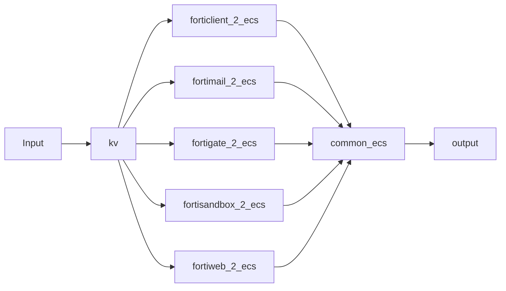

# FortiDragon (fortinet-2-elasticsearch) 🐉


## Engage

Join our community on [Discord](https://discord.gg/9qn4enV) 🤓. Feel free to ask about anything on the channel.

You are already saving a lot of money by using Fortinet+Elastic, so consider making a contribution to the project. 💰💰💰 (It is **NOT** a must for asking for help)

- [Paypal](paypal.me/fortidragon)
- [Buy me a coffee](https://www.buymeacoffee.com/fortidragon) ☕
- Patreon: soon

## FortiDragon 🆚 Filebeat

So you want to take you Fortinet logs to Elasticseach??? You have come to the right place!!! 👍

But wait! Doesn't Elastic provide a [Filebeat module for Fortinet](https://www.elastic.co/guide/en/beats/filebeat/current/filebeat-module-fortinet.html)??? Why should you go with all the logstash hassle?? 🤷

Well, Filebeat module and Fortidragon are like cousins 👪. The logic for Filebeat module for Fortigate was based on FortiDragon, [we colaborated together with Elastic when they made it](https://github.com/elastic/beats/pull/17890).

The main differences would be

| Category | FortiDragon | Filebeat |
| -------- | ----------- | ---------|
| Dashboard | We got super cool dashboards!!! | None yet 😢 |
| Updates | Much more often | Dependant to Elastic releases |
| Installation | Harder| Easier |

The real reason behind is that we use FortiDragon on our day to day operations for threat hunting, so updates and constant evolution is more fluid.

If you can handle the hassle of logstash installation, it is worth the effort.

## TL;DR

Let's get this party on!!! 🤩

### On Fortigate

1. Configure syslog

```
    config log syslogd setting
        set status enable
        set server "logstash_IP"
        set port 5140
    end
```

2. [Extendend logging on webfilter](https://docs.fortinet.com/document/fortigate/7.2.0/fortios-log-message-reference/496081/enabling-extended-logging) **OPTIONAL**

```
    config webfilter profile
        edit "test-webfilter"
            set extended-log enable
            set web-extended-all-action-log enable
        next
    end
```
No need for syslogd on mode reliable, at least on v6.2 and v.6.4

### On Kibana

1. Load ingest pipeline

```
PUT _ingest/pipeline/add_event_ingested
{
  "processors": [
    {
      "set": {
        "field": "event.ingested",
        "value": "{{_ingest.timestamp}}"
      }
    }
  ]
}
```

2. Create ILM policies according to your needs. You can use these [examples](https://github.com/enotspe/fortinet-2-elasticsearch/tree/master/index%20templates/ilm). Make sure you name them:

- logs-fortinet.fortigate.traffic
- logs-fortinet.fortigate.utm
- logs-fortinet.fortigate.event

In our experience, `type=traffic` generates lots of logs, while `type=event` very few. So it makes sense to have different lifecycles for differente types of logs. Other slicing ideas can be found [below](https://github.com/enotspe/fortinet-2-elasticsearch/tree/master#output).

3. Load [component templates](https://github.com/enotspe/fortinet-2-elasticsearch/tree/master/index%20templates/component%20templates). You can use this [script](https://github.com/elastic/ecs/tree/main/generated/elasticsearch#instructions) or do it manually one by one:

```
PUT _component_template/ecs-base
{
  "_meta": {
    "documentation": "https://www.elastic.co/guide/en/ecs/current/ecs-base.html",
    "ecs_version": "8.3.1"
  },
  "template": {
    "mappings": {
      "properties": {
        "@timestamp": {
          "type": "date"
        },
        "labels": {
          "type": "object"
        },
        "message": {
          "type": "match_only_text"
        },
        "tags": {
          "ignore_above": 1024,
          "type": "keyword"
        }
      }
    }
  }
}
```

4. Load [index templates](https://github.com/enotspe/fortinet-2-elasticsearch/tree/master/index%20templates/index%20templates)

5. Load [Dashboards](https://github.com/enotspe/fortinet-2-elasticsearch/tree/master/kibana): Go to Management --> Stack Management --> Saved Objects --> Import

6. Enable dashboard controls: Go to Management --> Kibana Advanced Settings --> Presentation Labs --> Enable dashboard controls

### On Logstash

1. [Install Logstash](https://www.elastic.co/guide/en/logstash/current/installing-logstash.html)

2. A good idea would be to setup your ES password as a [secret](https://www.elastic.co/guide/en/logstash/current/keystore.html#add-keys-to-keystore)

3. Logstash Hostname **OPTIONAL**

Add HOSTNAME="myhostname" to /etc/default/logstash when running logstash as a service

```
echo $HOSTNAME | tee  -a /etc/default/logstash
```

It is very useful if you run several logstash instances.

4. Install tld filter plugin
```
    cd /usr/share/logstash
    sudo bin/logstash-plugin install logstash-filter-tld
```
5. Copy [pipelines.yml](https://github.com/enotspe/fortinet-2-elasticsearch/blob/master/logstash/pipelines.yml) to your logstash folder.
6. Copy [conf.d](https://github.com/enotspe/fortinet-2-elasticsearch/tree/master/logstash/conf.d) content to your conf.d folder.
7. [Disable ECS Compatibility](). (FrotiDragon pipelines were created back on logstash v7, so some filters might be incompatible with how renames expect source fields names. It should be fixed soon).
8. [Start logstash](https://www.elastic.co/guide/en/logstash/current/running-logstash.html)

Hopefully you should be enjoying your logs by now. 🕺💃

## Pipelines sequence

The overall pipeline flow is as follows:




### Input Syslog

Just receives syslog logs and populates `event.module` and `event.dataset` fields depending on udp port.
You can also uncomment Fortianalyzer tags is you are using it for syslog forwarding. Fortianalyzer stamps its own date format to the log, so it needs to be treated different on next pipeline.

### KV Syslog

Splits the original log into key-value pairs and sets the timestamp. Timezone is also obtained from the log itself if FortiOS v6.2+.

### Fortigate 2 ECS

* Validates nulls on IP fields (Fortinet loves to fill with "N/A" null fields, which turns into ingestion errors if your field has IP mapping).
* Renames Fortigate fields that overlaps with ECS.
* Translates Fortigate field to ECS by `type` of logs.
* Introduces `network.protocol_category` used on dashboards controls.
* Populates other ECS fields based on ECS recommendations, like `event.kind`, `event.category`, `event.type`.


### Common ECS

Populates several ECS fields based on other present fields.

- `*.locality` for private, loopback, link-local, multicast and public addresses. **These fields and not ECS official fields**.
- Geo localitzation of IPs. 🌎
- `related.ip` and `related.user`.
- `network.bytes` and `network.packets`.
- `event.duration`. ⌛
- `event.hour_of_day` and `event.day_of_week`. **These fields and not ECS official fields**.
- Calcualtes `network.community_id` just for tcp/udp.
- Registered domain.
- Url parsing.
- `user_agent.*`.
- `network.transport`.

### Output

This is crucial for index strategy 🤯. On Fortigate datastreams are split by `type`.

In our experience, `type=traffic` generates lots of logs, while `type=event` very few. Even inside `type=traffic` you might have that most of your logs have `action=denied`, so you may want to split them even further. Splitting into several datastreams allows to assign different ILMs policies and also will be faster for searching.

## Datasets and ECS Translations

### Datasets

We need your help for getting the datasets for versions 6.2 and forward. Currently we only got [this](https://github.com/enotspe/fortinet-2-elasticsearch/tree/master/datasets). Fortinet fields are always "evolving" (changing witout any notice and logic), and not all changes get docummented on Log Reference releases. Any help on taking a Log Refence file and transform it into a csv will be welcome. 🆘

### Translations Sheets

Once we got the Log Reference guides turned into spreadsheets we could process the data. We had to denormalize data, merge fields, verify fields mapping (data type), look for fileds that overlap with ECS fields, translate fields to ECS, make mappings and pipelines configs.

We plan to consolidate datasets per major version in a single spreadsheet.


### Fortigate


> [FortiOS_6.2.X_Log_Reference - Public](https://docs.google.com/spreadsheets/d/1m4hHrjSSCvIMTNCliRDBL6cW_IlQCyhqOTfwHtjVHoQ/edit?usp=sharing)


Fortigate logs are an ugly beast, mainly because its lack of (good) documentation. Altough it has been improving, it is still far from being coherent. For example, starting from 6.2.1, type "utm" was documented, altough it existed long ago.

On top of that, GTP events cause some field mismatch mapping like:


* checksum: `string  | uint32`

* from: `ip  | string`

* to: `ip  | string`

* version: `string  | uint32`


As far as we are concern, GTP is only part of Fortigate Carrier, which is a different product (¿?) How can Fortigate manage a field that has 2 different data types in its internal relational database? how does fortianalyzer do it? We have no idea because we have never seen GTP events on a real scenario. In order to avoid any data type mismatch, GTP events are not going to be considered, and unless you use Fortigate Carrier, you are not going to see them either.

The spreadsheet goes like:

1. `Data 6.2.X` is the denormalized data set obtained from the Log Reference Guide of version 6.2.X. This is the raw dataset of every version.

2. `Data` has all the datasets combined from `Data 6.2.X` sheets. You can look at it as the denormalize version of all datasets of major release 6.2.

3. On `Overlap ECS - Summary of fields`, we look for any field on Fortigate dataset that could overlap with ECS fields. First we consolidate all fields with a dynamic table, and then lookup for it over root fields on `ECS 1.X`. For example, Fortigate dataset has field `agent`, which overlaps with field `agent` on ECS. If we find an overlap, we propose a rename for Fortigate field: `fortios.agent`.

4. We have decided to slice the full dataset by type, resulting in 3 datasets: traffic, utm and event. Each of them has its own translation. So, on sheets `Summary of "traffic type" fields`, `Summary of "utm type" fields` and `Summary of "event type" fields` we consolidate the fields of each dataset independently.

5. On `ECS Translation of "XXX type" fields` is where the magic happens. Based on our criteria, we translate to ECS the fields we consider can fit.

6. On `logstash - XXX` we consolidate the translated fields of previous sheets and generate logstash code.

7. On `fortigate mapping` we filter all fortigate fields that are not string and. Based on its type, mapping is generated. The template we use consider keyword as default mapping, this is why we only explicitly define non-keyword fields.

**Translation is where we need more help from the community!!! Any suggestions are welcome**.


### Fortisandbox

> [FortiSandbox - Log Reference v3.1.2 - Public](https://docs.google.com/spreadsheets/d/1Dm8z1nnDI9G2ANJYn5Eaq2DVQhwiESFZPuFDro-JEHQ/edit?usp=sharing)

**Not updated in a while** 😕

### Fortiweb

> [FortiWeb_6.2.0_Log_Reference - Public](https://docs.google.com/spreadsheets/d/19YpCfLGtaU3DnDRWTLKaQXOoVc4up7lFCu1SfCIofT4/edit?usp=sharing)

**Not updated in a while** 😕

## Dashboards

We have tried to follow Fortigate´s Logs & Report section. Main objective of these dashboards is to analyze key KPIs in order to spot anomalies on it.

We have migrated eveythigh to Lens now, so that has helped a lot on performance, but still it is very recommended to fine tune the dashboards with the relevant info to your needs. There a lot of visualizations on each dashboard so keep in mind performance can be impacted (loading times).

### Structure

All dashboards are connected via its header structure. Making it easy to navigate trough them.


Dashboards follow a (max) 3 layer structure, going from more general to more specific.

1. Top level reference Fortinet´s type field: traffic, utm or event. UTM is already disaggregated so it can be easier to go to an specif UTM type, just like in Fortigate´s Logs & Report section.

2. Second level dives into *traffic direction* (if possible). For example: on traffic dashboard, we have `Outbound | Inbound | LAN 2 LAN`. It makes total sense to analyze it separetly.

3. Third level refers to which metric are we using for exploring the dataset: we only use sessions and bytes.

* sessions: we consider each log as a unique session.

* bytes: we analyze `source.bytes` and `destination.bytes` by both sum and average.


We need to filter out [logid=20](https://kb.fortinet.com/kb/documentLink.do?externalID=FD43912), so we dont get duplicate data when running aggregations.

You can do it on the firewall itself

```
config log syslogd filter
        set filter "logid(00020)"
        set filter-type exclude
   end
```

We have filter it out on [logstash](https://github.com/enotspe/fortinet-2-elasticsearch/blob/master/logstash/conf.d/fortigate_2_ecs.conf#L529).

You could also do it on Kibana itself.


4. Controls, above header structure, let you quickly filter your data.

### Visualizations

Dashboards have 2 sections, the upper visualizations are specific fields for the dataset that it is been analyzed on the dashboard: on webfilter we would see `catdesc` and `url.domain` for example. The lower visualizations are entity specific, on the first row there will always be `source.ip`, `destination.ip`, `network.protocol` which are fields that are present on all logs. The second raw has entities that might be useful on the analysis of that specific dashboard.

## Limitations

We have not tested it yet on FortiOS v7+

## Roadmap 🛣️

- ECS compatibility for pipelines.
- More dashboards: SD-WAN, traffic shapping, consolidated risk-score, etc.
- Canvas for reports and C-level presentations.
- Explore other ingest options: [Kafka](https://www.youtube.com/watch?v=KMbRoBbQUVw&feature=youtu.be) and [Rsyslog](https://github.com/enotspe/fortinet-2-elasticsearch/issues/37)
- Explore other visualization alternatives: Grafana
- [IoC enrichment](https://www.youtube.com/watch?v=8yf9DJ_TO6o). IoC in general has 2 sides: enriching a log that is currently being ingested, and enriching a log that has already been ingested. Both approachs are needed, and both have very different challenges.
- **Transforms: go from logs to Key Security Indicators (KSI)** 💡💡💡


## Authors

Logstash pipelines and Elasticsearch config [@hoat23](https://github.com/hoat23) and [@enotspe](https://github.com/enotspe) 🐉

Dataset analysis and Kibana [@enotspe](https://github.com/enotspe) 🐉

Current maintenance [@enotspe](https://github.com/enotspe) 🐉
