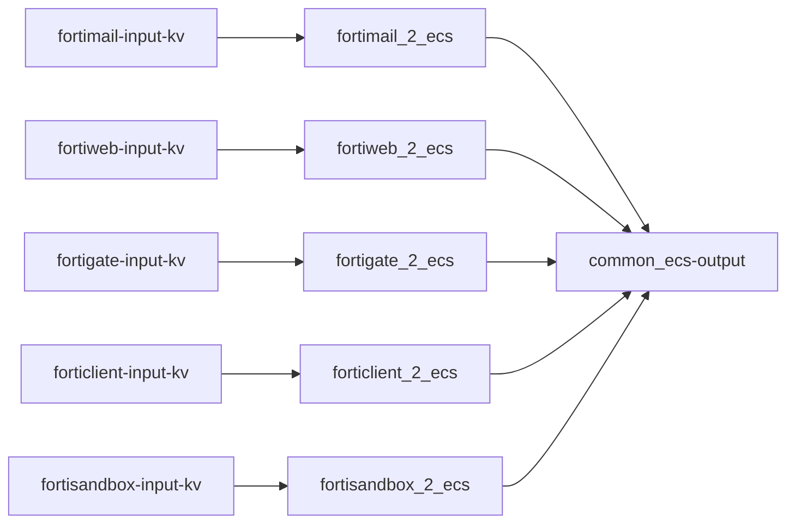
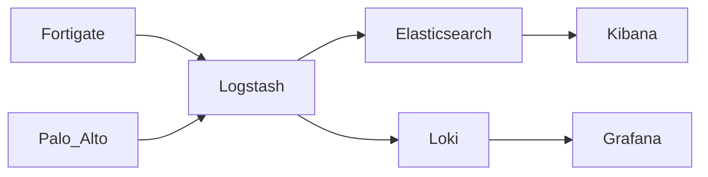

# FortiDragon (fortinet-2-elasticsearch) 🐉


## Engage

Join our community on [Discord](https://discord.gg/9qn4enV) 🤓. Feel free to ask about anything on the channel.

You are already saving a lot of money by using Fortinet+Elastic, so consider making a contribution to the project. 💰💰💰 (It is **NOT** a must for asking for help)

- [Paypal](https://www.paypal.com/paypalme/fortidragon) 🤑

## FortiDragon 🆚 Filebeat

So you want to take you Fortinet logs to Elasticseach??? You have come to the right place!!! 👍

But wait! Doesn't Elastic provide a [Filebeat module for Fortinet](https://www.elastic.co/guide/en/beats/filebeat/current/filebeat-module-fortinet.html)??? Why should you go with all the logstash hassle?? 🤷

Well, Filebeat module and Fortidragon are like cousins 👪. The logic for Filebeat module for Fortigate was based on FortiDragon, [we colaborated together with Elastic when they made it](https://github.com/elastic/beats/pull/17890).

The main difference is that FortiDragon is a full anayltics platform for threat hunting with Fortinet datasources, we do not restrict it to just the "ingestion" of logs. 

We actually use FortiDragon on our day to day operations for threat hunting, so we undestand all the painpoints of a security analyst. That is why we created it on the first place, after 10+ years experience with Fortinet we could not find a solution that could extract all the juice out of Fortinet logs. We tried several SIEMs along the way and found out that firewall logs are just a checkbox on their datasheet. Full parsing and performance for such volume of logs was not carefully considered by any SIEM vendor. Finally we decided we needed to build it ourselves and chose Elastic because of its flexibility, performance and cost. FortiDragon is by far the best out there.

Some notable differences are with Filebeat:

| Category | FortiDragon | Filebeat |
| -------- | ----------- | ---------|
| Dashboard | We got super cool dashboards!!! | Just one for now 😢 |
| Other platforms | FortiEDR, Forticlient, Fortimail, Fortiweb | Just Fortigate |
| Updates | Much more often | Dependant to Elastic releases |
| Installation | Harder| Easier |

If you can handle the hassle of logstash installation, it is worth the effort.

## Installation

Let's get this party on!!! 🤩

### On Fortigate

1. Configure syslog

  ```
    config log syslogd setting
        set status enable
        set server "logstash_IP"
        set port 5140
    end
  ```

  Or if you run FortiOS v7, you can use syslog5424. **RECOMMENDED**

  ```
    config log syslogd setting
        set status enable
        set server "logstash_IP"
        set port 5141
        set format rfc5424
    end
  ```
  You have to be very careful with your firewall name when usinng syslog5424 format
  
  `MY_FIREWALL_SITEA` will not work
  
  `MY-FIREWALL-SITEA` will work


2. [Extendend logging on webfilter](https://docs.fortinet.com/document/fortigate/7.2.0/fortios-log-message-reference/496081/enabling-extended-logging) **OPTIONAL**

  ```
    config webfilter profile
        edit "test-webfilter"
            set extended-log enable
            set web-extended-all-action-log enable
        next
    end
  ```

  You may get a warning that you need to change to reliable syslogd. Remember that "The full rawdata field of 20KB is only sent to reliable Syslog servers. Other logging devices, such as disk, FortiAnalyzer, and UDP Syslog servers, receive the information, but only keep a maximum of 2KB total log length, including the rawdata field, and discard the rest of the extended log information."

3. If you also would like to have metrics about your SDWAN Performance SLAs and view them in the SDWAN dashboard, you need to set both `sla-fail-log-period` and `sla-pass-log-period` on your healthchecks.

  ```
    config health-check
        edit "Google"
            set server "8.8.8.8" "8.8.4.4"
            set sla-fail-log-period 10
            set sla-pass-log-period 30
            set members 0
            config sla
                edit 1
                    set latency-threshold 100
                    set jitter-threshold 10
                    set packetloss-threshold 5
                next
            end
        next
    end
  ```

4. You can also pump your own fields into Fortigate's syslog **OPTIONAL**
  ```
    config log custom-field
        edit "3"
            set name "org"
            set value "some_organization_name"
        next
    end
    
    config log setting
        set custom-log-fields "3"
    end
  ```


### On Kibana (Dev Tools)

1. Load ingest pipeline **OPTIONAL** Remember to comment out on the output pipeline if you decide not to use it.

```
PUT _ingest/pipeline/add_event_ingested
{
  "processors": [
    {
      "set": {
        "field": "event.ingested",
        "value": "{{_ingest.timestamp}}"
      }
    }
  ]
}
```

2. Create ILM policies according to your needs. You can use these [examples](https://github.com/enotspe/fortinet-2-elasticsearch/tree/master/index%20templates/ilm). Make sure you name them accordingly to your index strategy. For our case, that would be:

- logs-fortinet.fortigate.traffic
- logs-fortinet.fortigate.utm
- logs-fortinet.fortigate.event

  In our experience, `type=traffic` generates lots of logs, while `type=event` very few. So it makes sense to have different lifecycles for differente types of logs. Other slicing ideas can be found [below](https://github.com/enotspe/fortinet-2-elasticsearch/tree/master#common-ecs--output).

3. Load component templates both from [Elastic ECS](https://github.com/elastic/ecs/tree/main/generated/elasticsearch/composable/component) and [FortiDragon specific](https://github.com/enotspe/fortinet-2-elasticsearch/tree/master/index%20templates/component%20templates). Do it manually one by one:

```
PUT _component_template/ecs-base
{
  "_meta": {
    "documentation": "https://www.elastic.co/guide/en/ecs/current/ecs-base.html",
    "ecs_version": "8.3.1"
  },
  "template": {
    "mappings": {
      "properties": {
        "@timestamp": {
          "type": "date"
        },
        "labels": {
          "type": "object"
        },
        "message": {
          "type": "match_only_text"
        },
        "tags": {
          "ignore_above": 1024,
          "type": "keyword"
        }
      }
    }
  }
}
```

4. Load [index templates](https://github.com/enotspe/fortinet-2-elasticsearch/tree/master/index%20templates/index%20templates)

5. Load [Dashboards](https://github.com/enotspe/fortinet-2-elasticsearch/tree/master/kibana): Go to Management --> Stack Management --> Saved Objects --> Import

6. Make sure dashboard controls are enabled: Go to Management --> Kibana Advanced Settings --> Presentation Labs --> Enable dashboard controls

### On Logstash

1. [Install Logstash](https://www.elastic.co/guide/en/logstash/current/installing-logstash.html)

2. A good idea would be to setup your ES password as a [secret](https://www.elastic.co/guide/en/logstash/current/keystore.html#add-keys-to-keystore)

3. Logstash Hostname **OPTIONAL**

  Add HOSTNAME="myhostname" to /etc/default/logstash when running logstash as a service

```
echo HOSTNAME=\""$HOSTNAME"\" | sudo tee  -a /etc/default/logstash
```

  It is very useful if you run several logstash instances.

4. Install tld filter plugin (You should do it every time you upgrade logstash version as well)
```
    cd /usr/share/logstash
    sudo bin/logstash-plugin install logstash-filter-tld
```
5. Copy [pipelines.yml](https://github.com/enotspe/fortinet-2-elasticsearch/blob/master/logstash/pipelines.yml) to your logstash folder.
6. Copy [conf.d](https://github.com/enotspe/fortinet-2-elasticsearch/tree/master/logstash/conf.d) content to your conf.d folder.
7. [Start logstash](https://www.elastic.co/guide/en/logstash/current/running-logstash.html)

Hopefully you should be dancing with your logs by now. 🕺💃

## Pipelines sequence

The overall pipeline flow is as follows:




### Input Syslog / KV

Receives syslog logs and populates `data_stream` fields depending on udp port.
You can also uncomment Fortianalyzer tags is you are using it for syslog forwarding. Fortianalyzer stamps its own date format to the log, so it needs to be treated different.

Splits the original log into key-value pairs and sets the timestamp. Timezone is also obtained from the log itself if FortiOS v6.2+.

### Fortigate 2 ECS

* Validates nulls on IP fields. Fortinet loves to fill with "N/A" null fields, which turns into ingestion errors if your field has IP mapping. We could do it with grok.
* Renames Fortigate fields that overlaps with ECS. In the future this will be done on the kv filter stage, to be more ECS compliant.
* Translates Fortigate field to ECS by `type` of logs.
* Introduces `network.protocol_category` used on dashboards controls. Mega useful!!!
* Populates other ECS fields based on ECS recommendations, like `event.kind`, `event.category`, `event.type`.


### Common ECS / Output

Populates several ECS fields based on other present fields.

- `*.locality` for private, loopback, link-local, multicast and public addresses. **These fields are not ECS official fields**.
- Geo localitzation of IPs. 🌎
- `related.ip` and `related.user`.
- `network.bytes` and `network.packets`.
- `event.duration`. ⌛
- `event.hour_of_day` and `event.day_of_week`. **These fields are not ECS official fields**.
- Calcualtes `network.community_id` just for tcp/udp.
- Registered domain.
- Url parsing.
- `user_agent.*`.
- `network.transport`.

Output is based on index strategy, which is crucial for large ingestion cases 🤯. On Fortigate datastreams are split by `type`.

In our experience, `type=traffic` generates lots of logs, while `type=event` very few. Even inside `type=traffic` you might have that most of your logs have `action=denied`, so you may want to split them even further. Splitting into several datastreams allows to assign different ILMs policies and also will be faster for searching.

Elasticseach has a "statical" approach to datastream definition because we have to somehow map our strategy to the datastream fields. If we would like to add a couple of fields to our splitting decision, like `action` and `source.locality`, we would need to insert those fields into `data_stream.dataset` and we might impact index template and ILM. Surely if we want to benefit from a faster searching on those fields we would need to change their mapping to `constant_keyword`. We don't know in advance how our data is distributed, and even if we knew, that might change on the future. On the other hand, [Grafana Loki](https://grafana.com/docs/loki/latest/fundamentals/labels/) provides a more "flexible" approach, we just index the fields that should "split" our data, and their are treated as labels. This looks really cool and we will be exploring Grafana Loki on the near future.

## Dashboards

We have tried to follow Fortigate´s Logs & Report section. Main objective of these dashboards is to do threat hunting by checking some critical KPIs in order to spot anomalies on them.

We have migrated eveythigh to Lens now, so that has helped a lot on performance, but still it is very recommended to fine tune the dashboards with the relevant info to your needs. There a lot of visualizations on each dashboard so keep in mind performance can be impacted (slow loading times or even failures when loading).

### Structure

All dashboards are connected via its header structure. Making it easy to navigate trough them.


Dashboards follow a (max) 3 layer structure, going from more general to more specific.

1. Top level reference Fortinet´s type field: traffic, utm or event. UTM is already disaggregated so it can be easier to go to an specif UTM type, just like in Fortigate´s Logs & Report section.

2. Second level dives into *traffic direction* (if possible). For example: on traffic dashboard, we have `Outbound | Inbound | LAN 2 LAN`. It makes total sense to analyze it separetly.

3. Third level refers to which metric are we using for exploring the dataset: we only use sessions and bytes.

* sessions: we consider each log as a unique session. Be careful is you have connections that go through several firewalls or vdoms.

* bytes: we analyze `source.bytes` and `destination.bytes` by both sum and average.

  [logid=20](https://kb.fortinet.com/kb/documentLink.do?externalID=FD43912) introduces duplicate data when doing aggregations (sum of bytes for a particular `source.ip`). That is why it is filtered out on all dashboards. It is recommended not to drop this logs as they might be useful for troubleshooting or forensic analysis.

4. Controls, above header structure, let you quickly filter your data.

### Visualizations

Dashboards have 2 sections:

1. The upper visualizations show specific fields for the dataset that it is been analyzed. We split the most meaningful fields by `action`, because that is why you bought a firewall in first place, to allow/block stuff.

2. The lower visualizations are entity specific, on the first row there will always be `source.ip`, `destination.ip`, `network.protocol` which are fields that are present on all logs. The second raw has entities that might be useful on the analysis of that specific dashboard.


## Datasets and ECS Translations

### Datasets

We need your help for getting the datasets for versions 6.2 and forward. Currently we only got [this](https://github.com/enotspe/fortinet-2-elasticsearch/tree/master/datasets). Fortinet fields are always "evolving" (changing witout any notice and logic), and not all changes get docummented on Log Reference releases. Any help on taking a Log Refence file and transform it into a csv will be welcome. 🆘

### Translations Sheets

Once we got the Log Reference guides turned into spreadsheets we could process the data. We had to denormalize data, merge fields, verify fields mapping (data type), look for fileds that overlap with ECS fields, translate fields to ECS, make mappings and pipelines configs.

We plan to consolidate datasets per major version in a single spreadsheet.


### Fortigate


> [FortiOS_6.2.X_Log_Reference - Public](https://docs.google.com/spreadsheets/d/1m4hHrjSSCvIMTNCliRDBL6cW_IlQCyhqOTfwHtjVHoQ/edit?usp=sharing)


Fortigate logs are an ugly beast, mainly because its lack of (good) documentation. Altough it has been improving, it is still far from being coherent. For example, starting from 6.2.1, type "utm" was documented, altough it existed long ago.

On top of that, GTP events cause some field mismatch mapping like:


* checksum: `string  | uint32`

* from: `ip  | string`

* to: `ip  | string`

* version: `string  | uint32`


As far as we are concern, GTP is only part of Fortigate Carrier, which is a different product (¿?) How can Fortigate manage a field that has 2 different data types in its internal relational database? how does fortianalyzer do it? We have no idea because we have never seen GTP events on a real scenario. In order to avoid any data type mismatch, GTP events are not going to be considered, and unless you use Fortigate Carrier, you are not going to see them either.

The spreadsheet goes like:

1. `Data 6.2.X` is the denormalized data set obtained from the Log Reference Guide of version 6.2.X. This is the raw dataset of every version.

2. `Data` has all the datasets combined from `Data 6.2.X` sheets. You can look at it as the denormalize version of all datasets of major release 6.2.

3. On `Overlap ECS - Summary of fields`, we look for any field on Fortigate dataset that could overlap with ECS fields. First we consolidate all fields with a dynamic table, and then lookup for it over root fields on `ECS 1.X`. For example, Fortigate dataset has field `agent`, which overlaps with field `agent` on ECS. If we find an overlap, we propose a rename for Fortigate field: `fortios.agent`.

4. We have decided to slice the full dataset by type, resulting in 3 datasets: traffic, utm and event. Each of them has its own translation. So, on sheets `Summary of "traffic type" fields`, `Summary of "utm type" fields` and `Summary of "event type" fields` we consolidate the fields of each dataset independently.

5. On `ECS Translation of "XXX type" fields` is where the magic happens. Based on our criteria, we translate to ECS the fields we consider can fit.

6. On `logstash - XXX` we consolidate the translated fields of previous sheets and generate logstash code.

7. On `fortigate mapping` we filter all fortigate fields that are not string and. Based on its type, mapping is generated. The template we use consider keyword as default mapping, this is why we only explicitly define non-keyword fields.

**Translation is where we need more help from the community!!! Any suggestions are welcome**.


### Fortisandbox

> [FortiSandbox - Log Reference v3.1.2 - Public](https://docs.google.com/spreadsheets/d/1Dm8z1nnDI9G2ANJYn5Eaq2DVQhwiESFZPuFDro-JEHQ/edit?usp=sharing)

**Not updated in a while** 😕

### Fortiweb

> [FortiWeb_6.2.0_Log_Reference - Public](https://docs.google.com/spreadsheets/d/19YpCfLGtaU3DnDRWTLKaQXOoVc4up7lFCu1SfCIofT4/edit?usp=sharing)

**Not updated in a while** 😕


## Limitations

We have not tested it yet on FortiOS v7+

## Roadmap 🛣️

We can divide the whole project into these phases:

### Ingestion

- Parsing (DONE ✅)
- ECS normalization (DONE ✅)
- Common enrichements (GeoIP, network.community_id, etc.) (DONE ✅)
- Fortigate v7 support, specially Syslog RFC5424 format. (WIP 🏗)
- Palo Alto support (WIP 🏗)
- [Asset Enrichment](https://www.youtube.com/watch?v=8yf9DJ_TO6o): Fortigate can map user identity inside the logs, but that is not enough. We need to map networks funtionality, assets risk and group. For example, we might have a critical application that may have several web servers, sveral backends and a distributed DB; we need to know in our logs that all those IPs belong to the same application, which is a critical asset for business. If an alert gets generated, we can treat it with more priority. 🧠
- IoC enrichment: IoC in general has 2 sides: enriching a log that is currently being ingested, and enriching a log that has already been ingested. Both approachs are needed, and both have very different challenges. For the first one, we can tweak the geoip filter for such purpose, [like these guys do for assets](https://www.youtube.com/watch?v=8yf9DJ_TO6o).
- Explore other ingest options: [Kafka](https://www.youtube.com/watch?v=KMbRoBbQUVw&feature=youtu.be) and [Rsyslog](https://github.com/enotspe/fortinet-2-elasticsearch/issues/37)

Ingestion should be about fortifying raw logs as much as possible, so we can have more inputs for doing analysis.

### Platform

One of the benefits of FortiDragon is that we are not limited to Elastic, we can use any tool we would like. Altough we love ELK, there are some other tools that can be used on specific areas such as Jupyter Notebooks or Google Colab for ML analytics, or Neo4j for graph analysis.

On the near future, we would like to integrate Loki/Grafana. Logstash already has a [Loki output plugin](https://grafana.com/docs/loki/latest/clients/logstash/), so it should not be very diffult to start testing it. We want to explore other visualization and alerting options.



### Analytics 🧠🧠🧠

We got our super enriched logs 🦾, now what 😕?? Well, firewall logs are just firewall logs: lots of them, very few value on each of them. We need to pivot from just logs to datapoints, by defining entities and features about the behaivor of those entities.

Traditionally we have used the [5 tuple concept](https://www.ietf.org/rfc/rfc6146.txt) to identify connections, meaning the components of the tuple are the important entities of any given connection. However, with next generation application firewalls we now have more relevant information, like application or user. We can define a "new" 5 tuple, composed of `source.ip`, `source.user`, `destination.ip`, `service` (destination port + protocol) and `application`. These are the entities on the NGFW world that are present on all connecions and we should analyze KPIs of them and the interation between them. 💡💡💡

For example, let's say in a period of 1 hour, we see an IP that has had connecions to a thousand different DNS servers. That is really weird, right?

What have we just done? We have definied `source.ip` as our entity, and we had definied `unique destination.ip on UDP/53 over 1 hour` as a feature of that entity, transforming all those 1k logs into a single document. We can define many features that can be relevant to take a look at. Those features are what we call Key Security Indicators (KSIs) and they will be the foundation for making sense out of network logs. Once we got KSIs for our entities, we can profile them just by checking how these KSIs evolve over time, or in comparisson to other entities in our infraestructure. We should use Transforms and ML of Elasticsearch for such purpose.

Another particular topic that has always had me wonder is P(A-->B), meaning the probability of A talking to B. We already got all the connections that are running on the network, so obtaining that probability should be trivial. More complex to calculate would be P(A-->B-->C), probability of A talking to C through B. What we are trying to get is the relations that different assets of our network have. If we mix it with KSIs of every individual asset, we can have a very powerful analysis. This seems particular useful for lateral movement and beaconing. For such analytics we need a graph database like Neo4j.

### Visualization

- More dashboards: SD-WAN, traffic shapping, consolidated risk-score, etc.
- Vega visualiations.
- Canvas for reports and C-level presentations. 🖌
- Grafana

## Authors

Logstash pipelines and Elasticsearch config [@hoat23](https://github.com/hoat23) and [@enotspe](https://github.com/enotspe) 🐉

Dataset analysis and Kibana [@enotspe](https://github.com/enotspe) 🐉

Current maintenance [@enotspe](https://github.com/enotspe) 🐉
