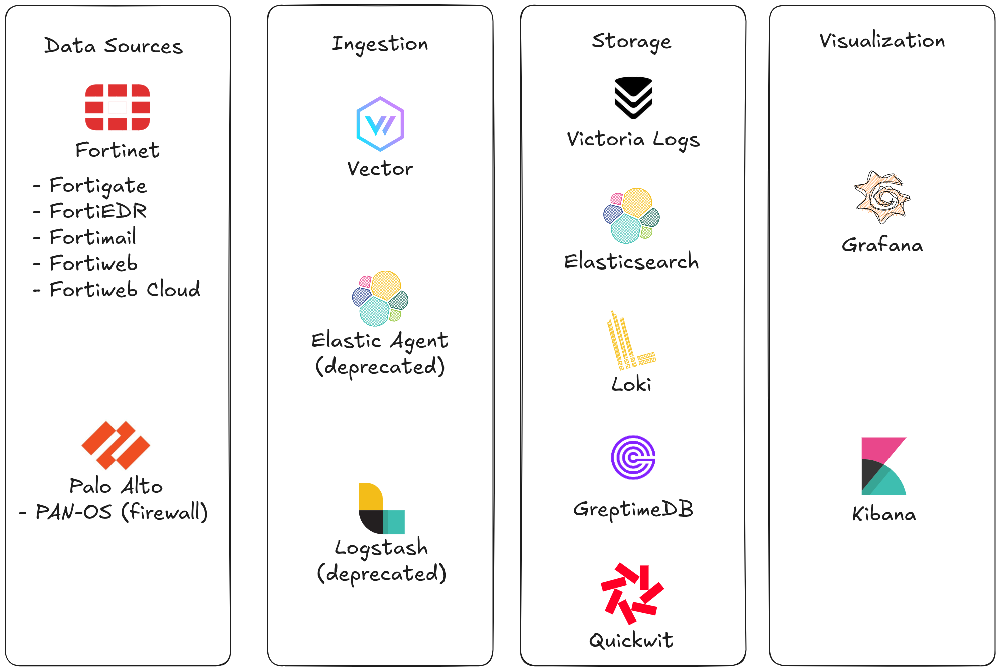

# Architecture

We have a modular architecture, each layer is independent from each other. So, what technology should you choose at each layer????

This is a little tricky, because we are not trying to establish comparisons based on benchmarks, just based on our personal experience ingesting and dissecting firewall logs with these platforms. Our judgment could be biased. 

## Data Sources

These are the supported platforms:

### Fortinet

- FortiGate (of course!!! [This is how it all began](index.md))
- FortiEDR
- FortiMail
- FortiWeb
- FortiWebCloud (FortiAppSec)

### Palo Alto

- PAN-OS (firewall)

## Ingestion

|                   | Logstash          | Elastic Agent     | Vector            |
| ----------------- | ----------------- | ----------------- | ----------------- |
| Centrally Managed | Yes. Paid plan    | Yes               | Yes. Paid plan    |
| Performance       | I was never able to go above 1k EPS. Above that threshold you need to make some crazy tweaking. Probable because is Java based | Great. It has different presets for different loads. | Great |
| Language          | Good              | Limited to Elastic functions. Can not make comments on the code. | Great. It even has a playground. Very detailed logging for errors. |
| **Conclusion**    | Migrated to Vector | Migrated to Vector | **Current depevelopment and maintance** |

We have a clear winner here: **Vector!**

## Storage

|  | **Victoria Logs** | **Elasticsearch Cluster** | **Elasticsearch Serverless** | **Quickwit** | **Loki** | **GreptimeDB** |
|------------|---------------|------------|----------|------------|------------|------------|
| Performance | Great! Go based | Too resource consuming, probably because it is based on Java | Great! | Great! Rust based | Slow. Fields tot [indexed])(https://grafana.com/docs/loki/latest/#overview) | - |
| Serverless (Object Storage) | Not yet | No | Yes | Yes | Yes | Yes |
| Scalability | Limited. Horizontally scallable by adding more nodes, but queries depend on the capacity of each node | Limited. Horizontally scallable by adding more nodes. Data can be replicated for improved query performance, but increases resource consumption on writing | Trully decoupled storage from CPU. Infinite scalling in theory | Trully decoupled storage from CPU. Infinite scalling in theory | Decoupled storage from CPU. Grafana plans on integrating Warpstream into the architecture | - |
| Schema | No | Yes | Yes | Yes | No | Yes |
| Simplicity | Super simple to setup! | Complicated | Less Complicated | Quickwit | Too many components. Comlicated to query | - |
| Query Language | Logsql: super robust | DSL: simple and good just for search, limited aggregations and piping, ES\|QL: super robust  | DSL: simple and good just for search, limited aggregations and piping, ES\|QL: super robust | very limited | LogQL: very complicated, slow adn very limited analytics| - |
| Price | Cheap | Not that Cheap | [Super Expensive][https://www.elastic.co/pricing/serverless-security] | Cheap | [Expensive](https://grafana.com/pricing/#logs) | - |
| Managed Cloud Offering | Yes | Yes | Yes (only offering) | Yes | Yes | Yes |
| Support | Great! | OK | OK | Community | OK | - |
| Roadmap | [Object Storage](https://docs.victoriametrics.com/victorialogs/roadmap/). Looks promising! | - | - | Sold to Datadog | Kafka, Iceberg. [Looks promising](https://www.youtube.com/watch?v=LWDeIHfAC9A)! | - |
| **Conclusion** | **Great**! | **RAM eater**  | **Too expensive** | **It was promising, but got discontinued** | **No analytics, very complicated and slow .. for [now](https://www.youtube.com/watch?v=LWDeIHfAC9A)** | **Want to test it** |

**VictoriaLogs** is on a very sweet spot of simplicity, performance and query power. And has a very actively depevelopment and suport from VictoriaMetrics team.

## Visualization

|                   | Kibana            | Grafana           | 
| ----------------- | ----------------- | ----------------- | 
| Multiple datasources | No | Yes | 
| ES\|QL for Elasticsearch | Yes | No | 
| Simplicity | Yes | Steap learning curve | 
| Customization | Yes. Trough Vega | Super! | 
| Cache | No | Yes | 
| Snapshots | No | Yes | 
| Colapsable Pannels | Yes | Yes |
| Dynamic Pannels | No | Yes | 
| Filters | Yes | Yes | 
| Reports | Yes. Paid | Yes. Paid | 
| **Conclusion**    | Will keep suppoting it | **Current depevelopment and maintance** |

We have a clear winner here: **Grafana!**
