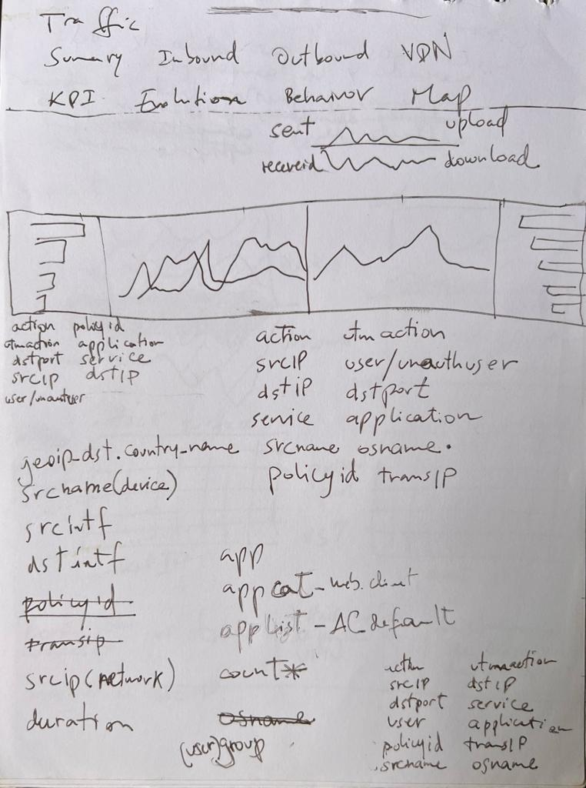
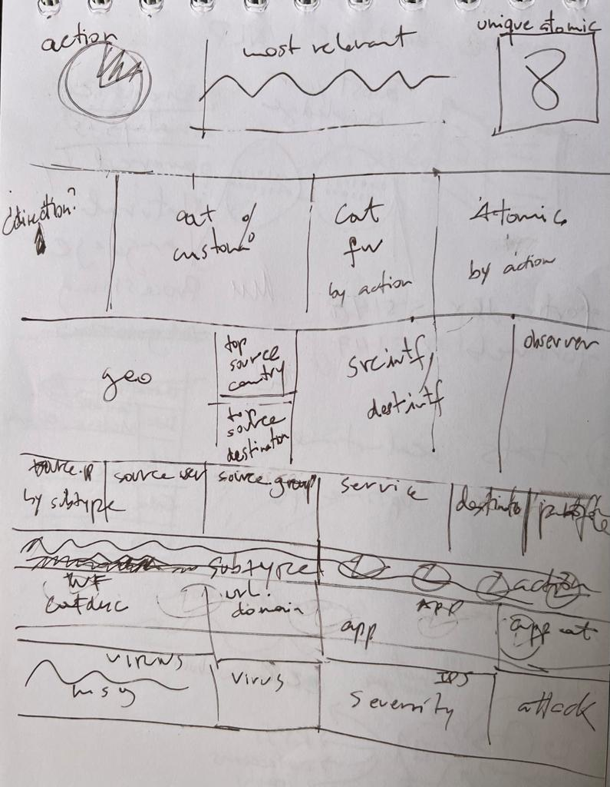
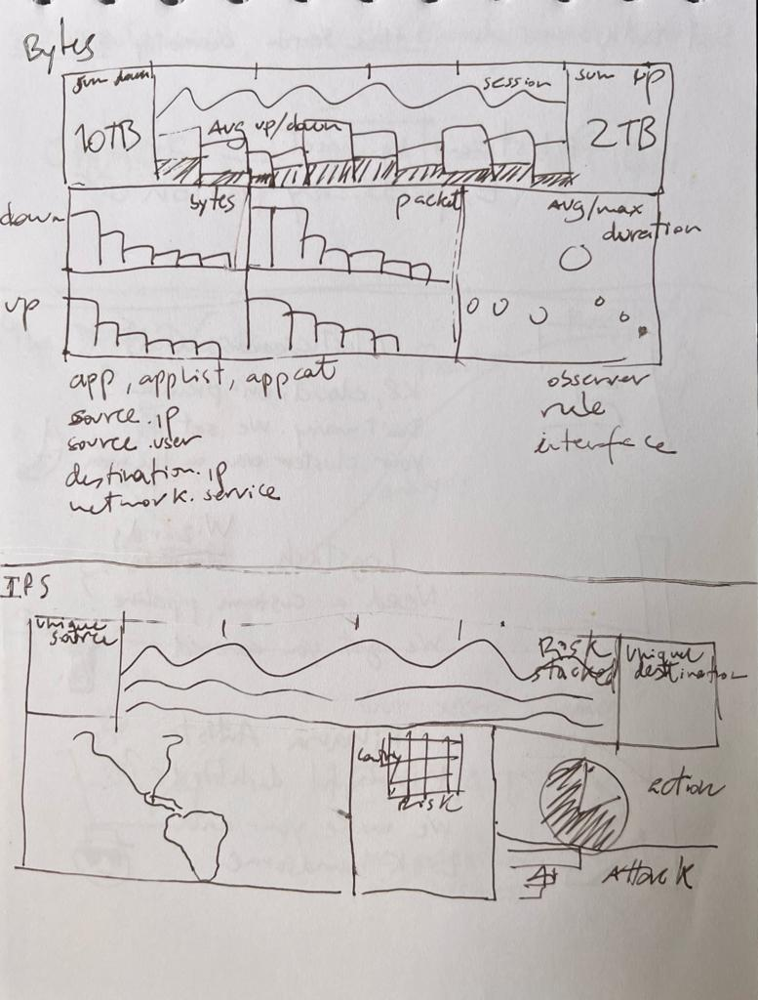
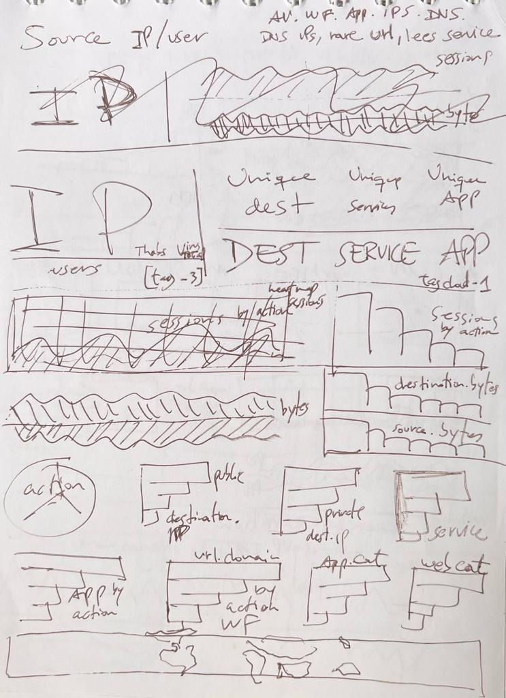
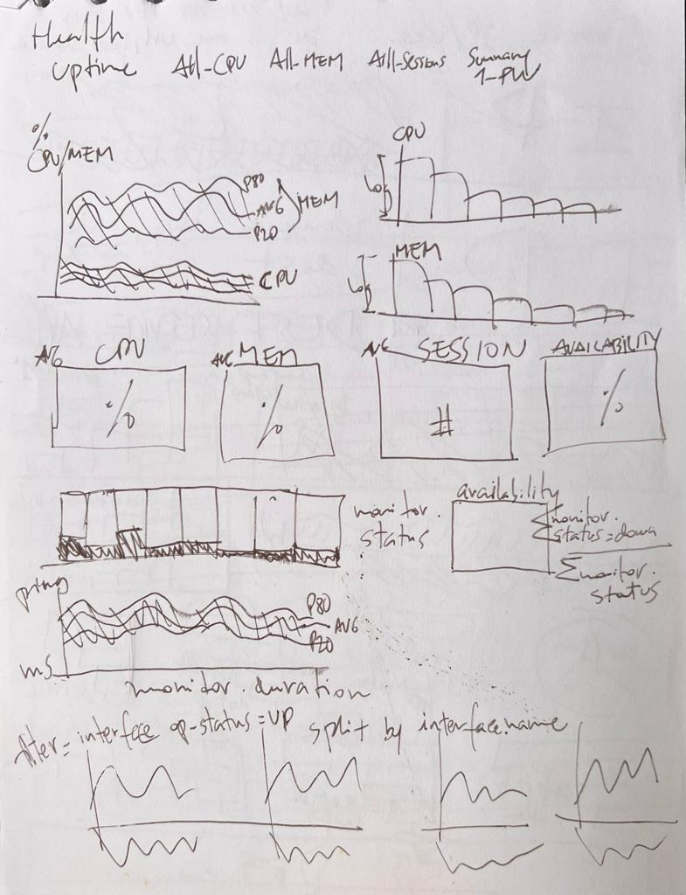
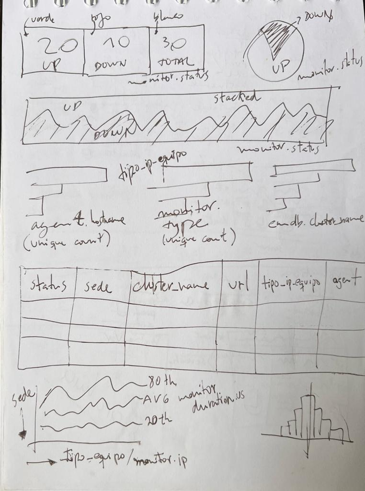
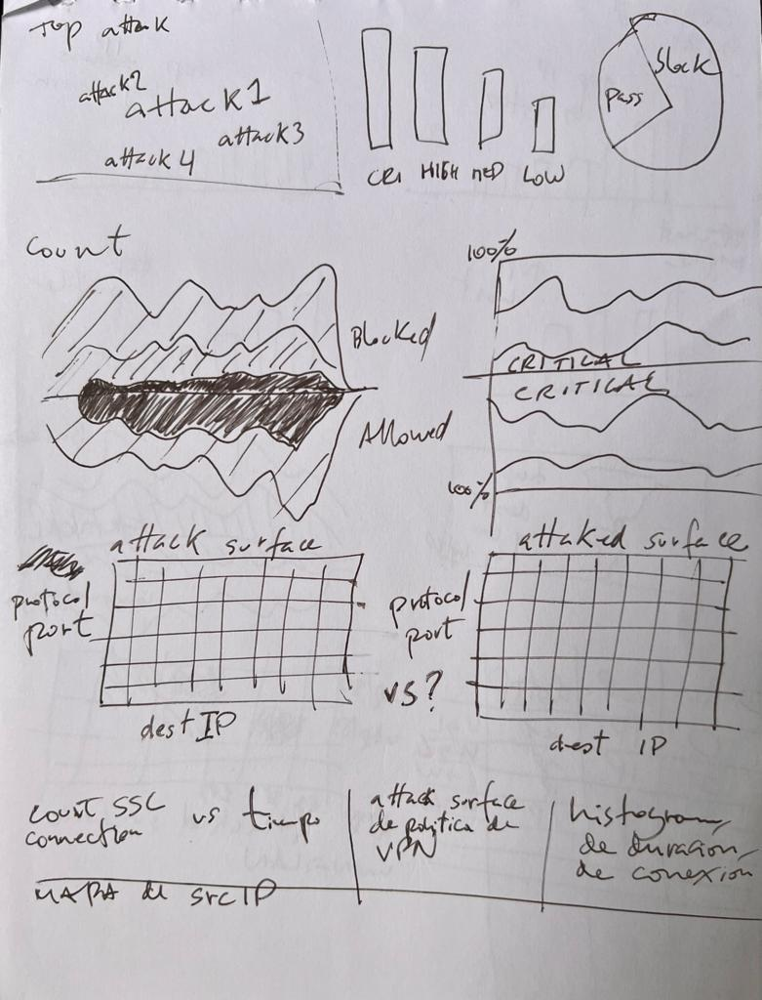
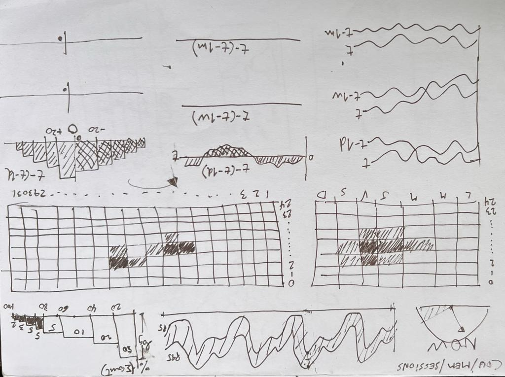

# The Blank Canvas

Facing Dashboard Designer's Dilemma
---

There's a peculiar moment of paralysis that strikes when you create a dashboard — that infinite white space staring back at you, cursor blinking expectantly, waiting for your first move. It's a feeling any artist knows intimately: the blank canvas syndrome.

Like a painter standing before a pristine white surface, brush in hand, you're suddenly overwhelmed by possibility. Should you start with a bold statement piece—a large visualization that commands attention? Or build up gradually with smaller insights? The options multiply exponentially: bar charts, line graphs, heat maps, scatter plots. Grid layouts or freeform designs. Dark themes or light. And which metrics deserve the spotlight?

This abundance of choice can be paralyzing. Every decision feels weighted with consequence, and the fear of making the "wrong" choice first can stop you from making any choice at all.

But here's what experienced dashboard designers and accomplished artists both understand: **the tools don't matter nearly as much as the vision**.

A painter doesn't obsess over whether to use oils or acrylics before understanding what they want to express. The medium serves the message, not the other way around. Similarly, the most sophisticated charting library or the trendiest visualization technique means nothing if you haven't first grasped what story your data is trying to tell.

The real work happens before you ever touch the canvas. It's in understanding your data deeply—its patterns, its anomalies, its context. It's in knowing your audience and what questions keep them up at night. It's in crystallizing the one insight that matters most and building everything else in service of that clarity.
The final measure of success isn't visual dazzle—it's usability. Does your dashboard answer questions or create new ones? Can someone glance at it and understand immediately, or do they need a manual? A beautiful painting that communicates nothing is merely decorative. A dashboard that doesn't drive decisions is just noise with pretty colors.

ltimately, the data speaks for itself. It guides you, shows you the way. The insights begin to emerge organically, revealing themselves like constellations in the night sky. You are merely a messenger, a storyteller—a conduit through which the data takes form and consciousness. It expresses itself through you, becoming an entity that transcends its own graphical representation, something greater than the sum of its numbers and charts. Your role is simply to let it breathe, to give it voice, to allow its truth to manifest.

  
  
  
  
  
  
  
  

- 
- 
- 
- 

The rest is just details.
