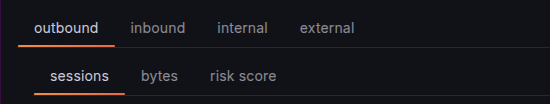
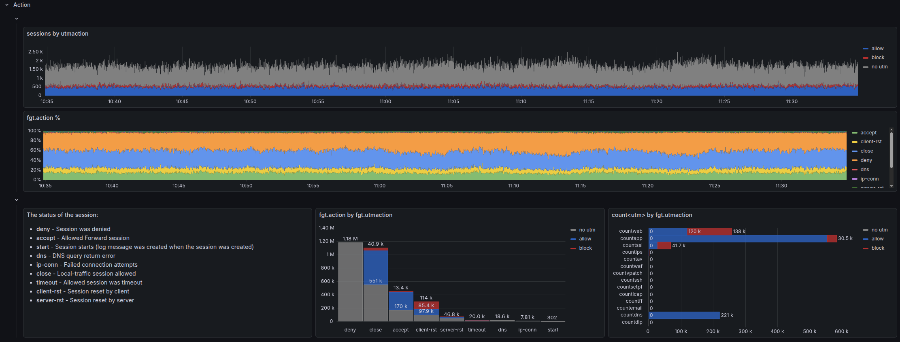
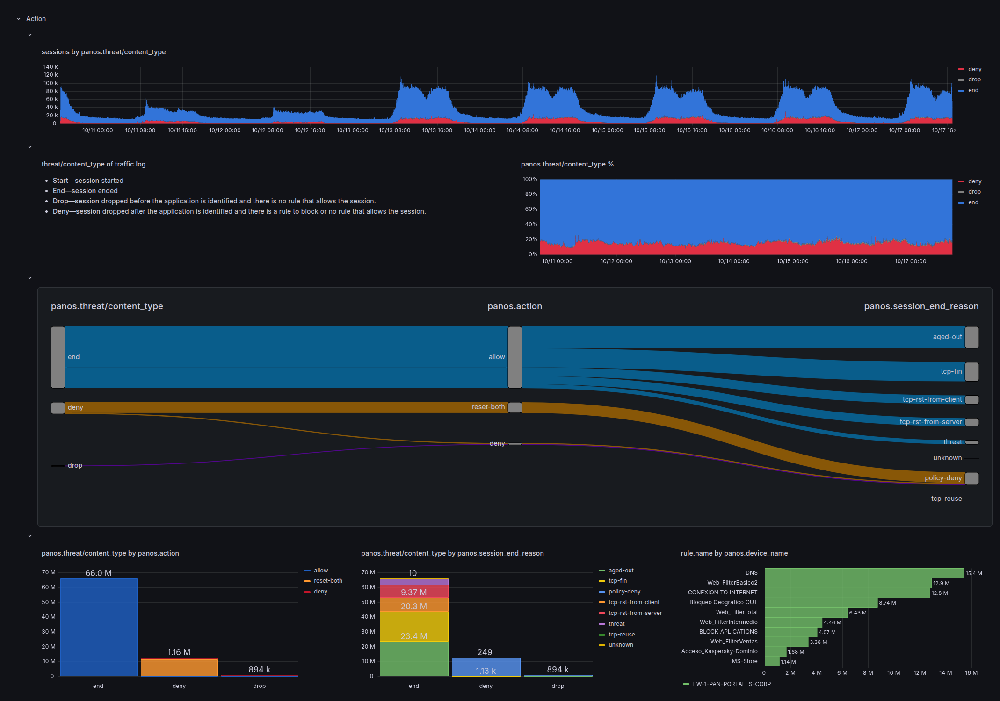
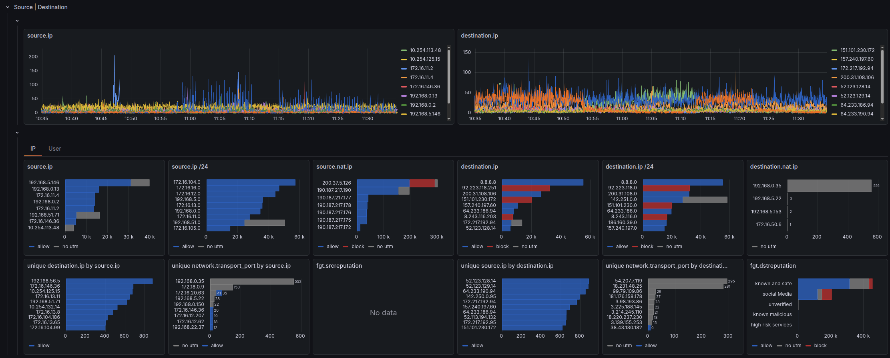
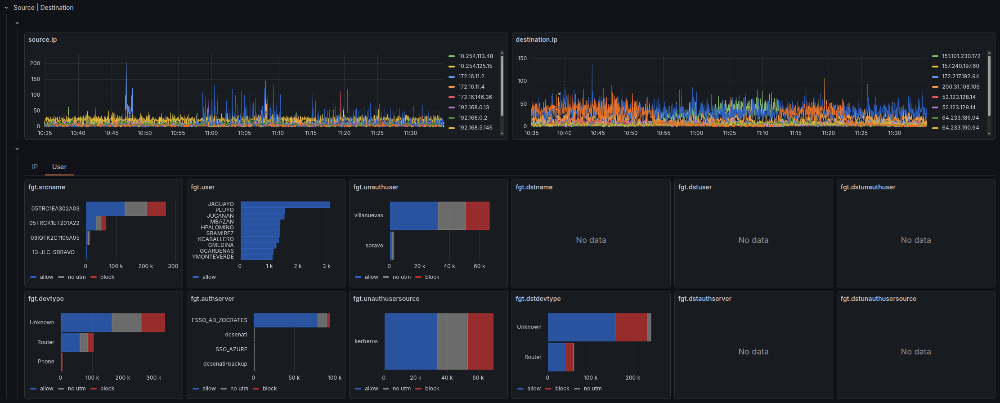
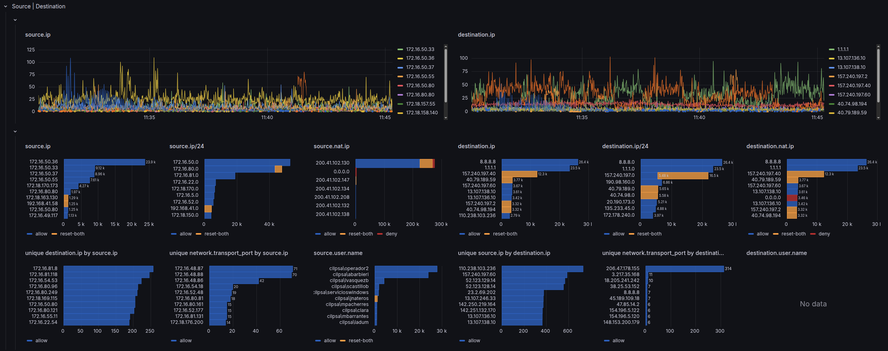
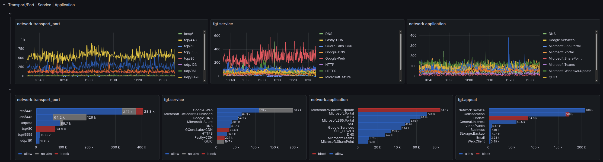
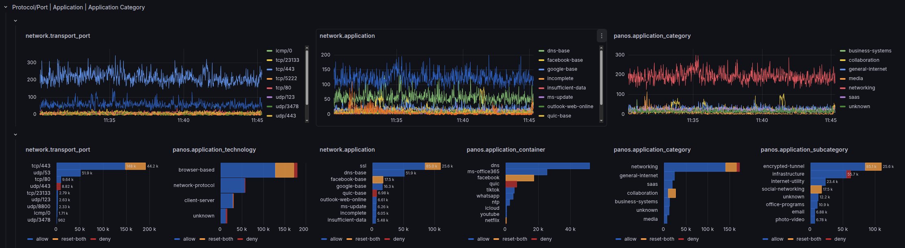

# Usage

Hopefully, our dashboards are very intuitive to use. They are intended for providing full visibility, not for a high-level view. They are intended for SOC analyst to use on threat hunting activities, fine tunning firewall policies, or any other activity that requires going deep into your data.

We tried to make dashboards look alike, not matter the vendor or dataset, so we provide a coherent user experience.

## Segmentation

We have segmented the analysis by `network.direction`

It is completely different if we have an attack in a connection coming from the internet than if an IP inside our servers network generated it.

Inside each direction, the analysis is done by a particular parameter: 

- Sessions (connections): We make the assumption that `1 log = 1 connection`. It is not 100% accurate, but a good approximation that is cheap to calculate. For 100% accuracy, we will have to calculate `unique count of session.id` which is very resource expensive.
- Bytes
- [Risk score](https://docs.fortinet.com/document/fortigate/7.2.0/administration-guide/903511/threat-weight) (Only on Fortinet dashboard)

## Action

Why do you buy a firewall in the first place??? **To block!**

Understanding what **action** your firewall took for each connection is the most relevant piece of information for security analysis. Every investigation starts here: "What did the firewall do?"

However, each firewall vendor has a different approach on how to understand *action* and what do they mean by it. 

It is a mixture of:

- what the configuration for that particular flow was
- how the connection ended
- whether there was a security flaw on that session

|Fortigate|Palo Alto|
|---------|---------|
| <ul><li>`action`: action taken by firewall policy, or if accepted, it refers to how the connection was ended.</li><li>`utmaction`: action took by the UTM engine, in case connection triggered at least of them.</li></ul>|<ul><li>`threat/content_type`: action took by the security engine.</li><li>`action`: action taken by firewall policy.</li><li>`session_end_reason`: why the session ended.</li></ul>|

### Fortigate

We combine the analysis of both `action` and `utmaction` in a timeline, percentage, and absolute fashion. As well as dissecting `utmaction` into the UTM engines that influence it.

### Palo Alto

We explore the relation between `threat/content_type`, `action` and `session_end_reason` on a [Sankey Diagram](https://grafana.com/grafana/plugins/netsage-sankey-panel/).

## Source | Destination

We dig further into the most elemental dimensions of a network connection: Source and Destination.

We try to explore its broadest: IP, network, user, etc.

- On the top row, there is the timeline analysis.
- On the middle row, there are total aggregated values: `count of logs over the whole time window`
- On the bottom row, there are more advance metrics that unveil more subtle insights like: `unique count of destination IP per source IP`

### Fortigate

Fortinet offers a lot information about IP, besides just the IP address. We have split the analysis on 2 tabs

- IP

    IP address, /24 network, NATed IP and [IP Reputation](https://docs.fortinet.com/document/fortigate/7.6.4/administration-guide/68937/ip-reputation-filtering)

- User

    We explore `user` and its derivations.

### Palo Alto

## Service | Application

`service` is the combination of `protocol` + `destination port`, like `https` is actually `tcp/443`

### Fortigate

However, on Fortinet, `service` gets the value of what you defined on `Policy and Objects/Services` **or** the [Internet Service](https://docs.fortinet.com/document/fortigate/7.6.4/administration-guide/849970/internet-services) that has matched that IP.

As we can not have 100% certainty that `tcp/443` = `https`. We have defined a new field: `network.transport_port`

### Palo Alto

Palo Alto does not provide `service` field, so we also defined: `network.transport_port`

