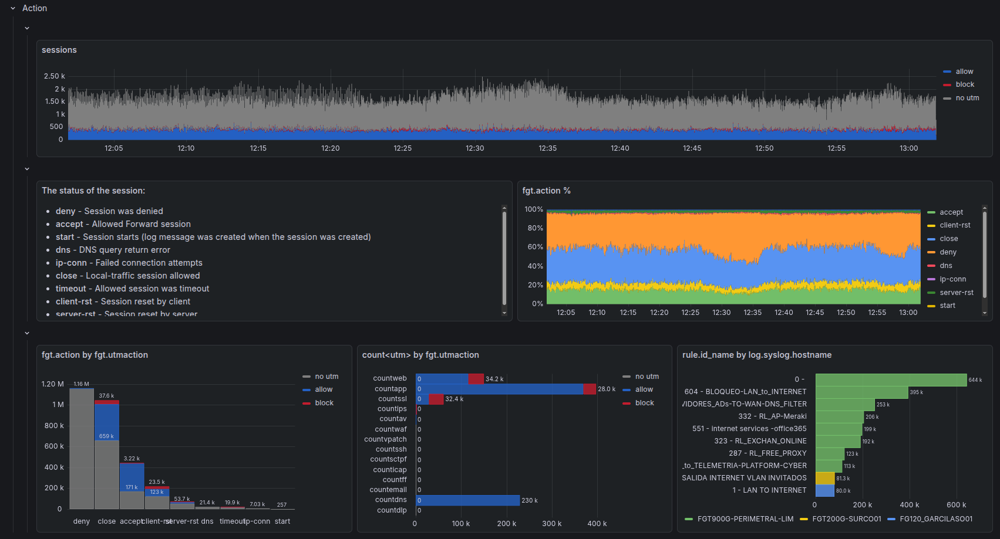

# Usage

Why do you buy a firewall in the first place??? **To block!**

Understanding what **action** your firewall took for each connection is the most relevant piece of information for security analysis. Every investigation starts here: "What did the firewall do?"

However, each firewall vendor has a different approach on how to undestand *action* and do they mean by it. 

It is a mixture of:

- what the configuration for that parituclar flow was
- how the connection ended
- whether there was a security flaw on that session

|Fortigate|Palo Alto|
|---------|---------|
| <ul><li>`action`: action taken by firewall policy, or if accepted, it refers to how the connection was ended.</li><li>`utmaction`: action took by the UTM engine, in case connection triggered at least of them.</li></ul>|<ul><li>`threat/content_type`: action took by the security engine.</li><li>`action`: action taken by firewall policy.</li><li>`session_end_reason`: why the session ended.</li></ul>|

## Fortigate

Fortigate has 2 kind of actions:

We combine the analysis of both in a timeline, percentage, and absolute fashion. As well as dissecting `utmaction` into the UTM engines that influence it.

## Palo Alto

We combine the analysis of both in a timeline, percentage, and absolute fashion. As well as dissecting `utmaction` into the UTM engines that influence it.

- metrics
- action
- dimensions & facts
