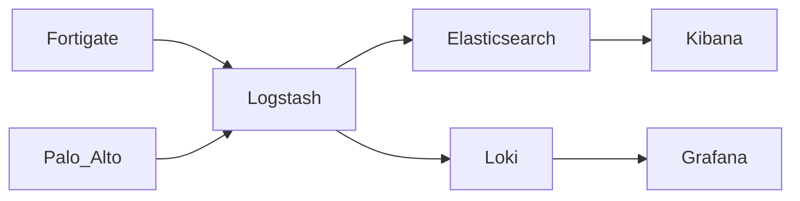

# FortiDragon 🐉

    

Welcome to **FortiDragon**! This project is designed to seamlessly integrate Fortinet logs with Elastic Stack (Grafana and Quickwit on the way!).

## Overview

FortiDragon aims to be a full analytics platform for threat hunting with Fortinet datasources. It leverages the Elastic Stack for efficient indexing, searching, visualizing and analyzing log data.

So you want to take your Fortinet logs to Elasticsearch??? You have come to the right place!!! 👍

## Engage

Join our community on [Discord](https://discord.gg/9qn4enV) 🤓. Feel free to ask about anything on the channel.

You are already saving a lot of money by using Fortinet+Elastic, so consider making a contribution to the project. 💰💰💰 (It is **NOT** a must for asking for help)

- [Paypal](https://www.paypal.com/paypalme/fortidragon) 🤑

## How it all began

We actually use FortiDragon on our day to day operations for threat hunting, so we understand all the painpoints of a security analyst. After 10+ years experience with Fortinet we could not find a solution that could extract all the juice out of Fortinet logs. We tried several SIEMs along the way and found out that firewall logs are just a checkmark on their datasheets. Full parsing and performance tuning for such volume of logs was not carefully considered by any SIEM vendor. Finally we decided we needed to build it ourselves and chose Elastic because of its flexibility, performance and cost. FortiDragon is by far the best option out there.

## Key Benefits

### 1. **Parsing**
- **Full field parsing**: Extracts all fields and values from Fortinet logs.
- **ECS Naming Standardization**: Translates Fortinet fields to [Elastic Common Schema (ECS)](https://www.elastic.co/guide/en/ecs/current/index.html) for consistent field naming.
- **Enrichment**: Enhances log data with additional contextual information.

### 2. **Analytics**
FortiDragon provides deep visibility into your network traffic. With comprehensive dashboards for threat hunting, you can easily monitor Fortinet logs in real-time. Here is where we shine! No other paid or free tool has such an in depth analysis of Fortinet logs.

### 3. **Quick Setup**
No more logstash hassle, simply run the provided script to install and configure all Elasticsearch components.

### 4. **Transparency**
We expose all filters at dashboard level, so you can always know what data you are querying. If you ever tried to debug a FortiAnalyzer query, you will know how valuable this is.

### 5. **Multiplatform Support**
- We already provide dashboards for [Palo Alto firewalls](https://github.com/enotspe/fortinet-2-elasticsearch/blob/master/kibana/panw%20panos%20ELK%208143.ndjson) and [Cortex XDR](https://github.com/enotspe/fortinet-2-elasticsearch/blob/master/kibana/panw%20cortex%20ELK%208132.ndjson).
- FortiDragon will support [Grafana](https://grafana.com/) and [Quickwit](https://quickwit.io/) in future releases.

## Quick Start

Ready to get started? Check out our [Installation Guide](installation/index.md) to begin your FortiDragon journey!

## Architecture

## Authors

Logstash pipelines and Elasticsearch config [@hoat23](https://github.com/hoat23) and [@enotspe](https://github.com/enotspe) 🐉

Dataset analysis and Kibana [@enotspe](https://github.com/enotspe) 🐉

Current maintenance [@enotspe](https://github.com/enotspe) 🐉
