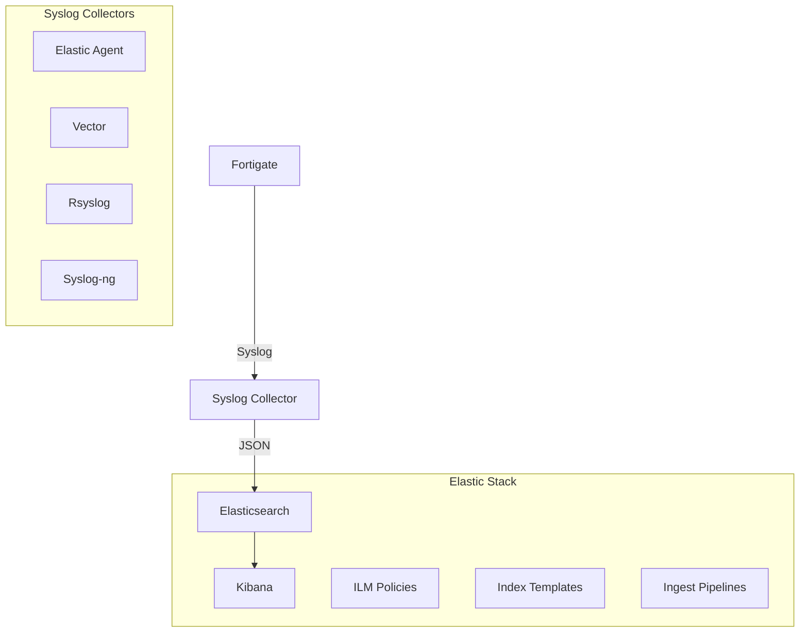

# Installation Overview

Let's get this party on!!! 🤩

FortiDragon installation involves setting up three main components:

1. **[Fortigate Configuration](fortigate.md)** - Configure your Fortigate firewall to send syslog data
2. **[Elastic Stack Setup](elastic.md)** - Install and configure Elasticsearch components  
3. **[Syslog Collectors](collectors.md)** - Set up collectors to receive and forward syslog data

## Architecture Overview

## Installation Steps

### Step 1: Fortigate Configuration
Configure your Fortigate firewall to send syslog data using RFC5424 format to your collector.

[→ Configure Fortigate](fortigate.md)

### Step 2: Elastic Stack Setup
Use our automated script to install all Elasticsearch components including:
- Index templates
- Ingest pipelines
- ILM policies
- Component templates

[→ Set up Elastic Stack](elastic.md)

### Step 3: Syslog Collector
Choose and configure a syslog collector to receive logs from Fortigate and send them to Elasticsearch:
- **Elastic Agent** (Recommended for Elastic Stack integration)
- **Vector** (Lightweight and fast)
- **Rsyslog** (Traditional Unix syslog)
- **Syslog-ng** (Advanced syslog daemon)

[→ Configure Collectors](collectors.md)

## Performance Considerations

!!! warning "High Volume Environments"
    Firewalls are very chatty! For high-volume environments, consider:
    
    - Tuning collector buffer sizes
    - Optimizing Elasticsearch output for throughput
    - Monitoring for dropped UDP packets
    - Using dedicated hardware for collectors

## Next Steps

Once installation is complete:

1. Import the provided [Kibana dashboards](../dashboards.md)
2. Configure dashboard controls in Kibana settings
3. Start monitoring your Fortinet logs! 🕺💃

**Hopefully you should be dancing with your logs by now!**
