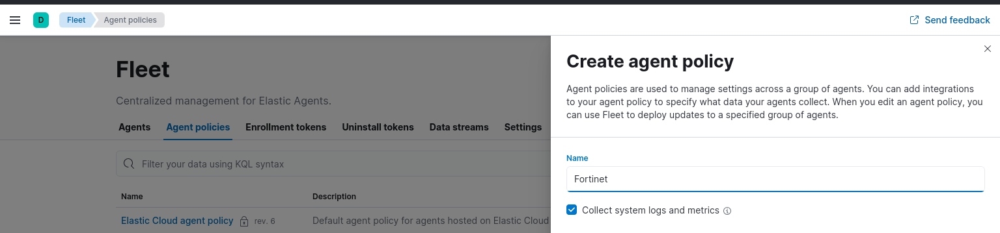
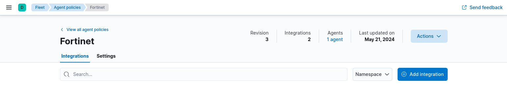
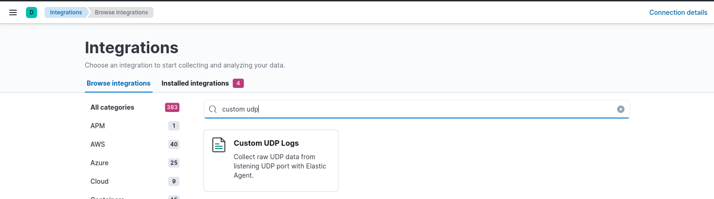
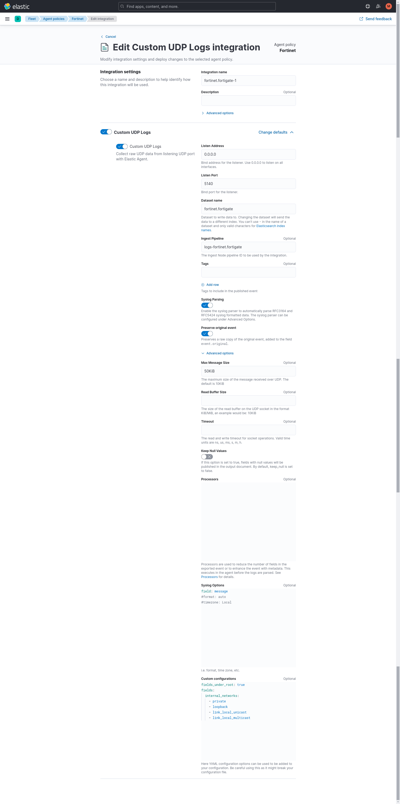

# Elastic Agent

!!! warning "DEPRECATED"
    ❌ Do not deploy Elastic Agent
    
    ✅ **Deploy Vector instead**

## Install Elastic Agent 
    
1. [Install Elastic Agent](https://www.elastic.co/guide/en/fleet/current/elastic-agent-installation.html) either [Fleet-managed](https://www.elastic.co/guide/en/fleet/current/install-fleet-managed-elastic-agent.html) or [standalone](https://www.elastic.co/guide/en/fleet/current/install-standalone-elastic-agent.html)

## Create Policy

2. Create an Agent Policy


3. Add Integration


4. Select Custom UDP Logs


5. Configure Custom UDP Logs integration


6. Make sure to add your own private networks under custom configurations. It is recommended to add your own public facing IP address scope as well.

7. Save Integration

## Deploy you policy.
- If you deployed Fleet-managed agent, just [apply your new policy to your agent](https://www.elastic.co/guide/en/fleet/current/agent-policy.html#apply-a-policy).

- If you deployed standalone agent, [take your generated policy](https://www.elastic.co/guide/en/fleet/current/create-standalone-agent-policy.html) and modify your [elastic-agent.yml](https://www.elastic.co/guide/en/fleet/current/installation-layout.html) accordinly.

You should end up with something like:

```yaml
  - id: udp-udp-af7f0dce-57c0-498f-bc09-96ba51fd76a4
    name: fortinet.fortigate-1
    revision: 1
    type: udp
    use_output: default
    meta:
      package:
        name: udp
        version: 1.19.1
    data_stream:
      namespace: default
    package_policy_id: af7f0dce-57c0-498f-bc09-96ba51fd76a4
    streams:
      - id: udp-udp.generic-af7f0dce-57c0-498f-bc09-96ba51fd76a4
        data_stream:
          dataset: fortinet.fortigate
        host: '0.0.0.0:5140'
        pipeline: logs-fortinet.fortigate
        max_message_size: 50KiB
        tags:
          - preserve_original_event
        processors:
          - copy_fields:
              fields:
                - from: message
                  to: event.original
          - syslog:
              field: message
        fields_under_root: true
        fields:
          internal_networks:
            - private
            - loopback
            - link_local_unicast
            - link_local_multicast
```

!!! warning "Ingest Pipelines"
    Ingest Pipelines are not loaded by default with our [script](../storage/elasticsearch.md/#set-load)
    
    Make sure to set `LOAD_INGEST_PIPELINES` to `true`

## Performance tunning settings

Firewalls are very chatty, so it may overflow UDP buffers on your host leading to dropping logs. 

Modify your `Elasticsearch output settings` for `Optimized for throughput`.

- If you deployed Fleet-managed agent, modify your Elaticsearch output `Perfomance Tunnig` setting for [`Throughput`](https://www.elastic.co/guide/en/fleet/current/es-output-settings.html#es-output-settings-performance-tuning-settings) directly under your [output configuration](https://www.elastic.co/guide/en/fleet/current/fleet-settings.html#output-settings).
- If you deployed standalone agent, modify your Elaticsearch output preset setting for [`throughput`](https://www.elastic.co/guide/en/fleet/current/elasticsearch-output.html#output-elasticsearch-performance-tuning-settings) on your [elastic-agent.yml](https://www.elastic.co/guide/en/fleet/current/installation-layout.html) directly.

Depending on your Events per Second (EPS) volume, you may need to increase performance tuning settings even further.

- Run `watch -d "column -t cat /proc/net/snmp | grep -w Udp"` on your Elastic Agent host to check if you are dropping any logs.


## Next Steps

1. Set up [Elasticsearch](../storage/elasticsearch.md)

2. Import dashboards in [Kibana](../viz/kibana.md)

3. Start dancing with your logs!