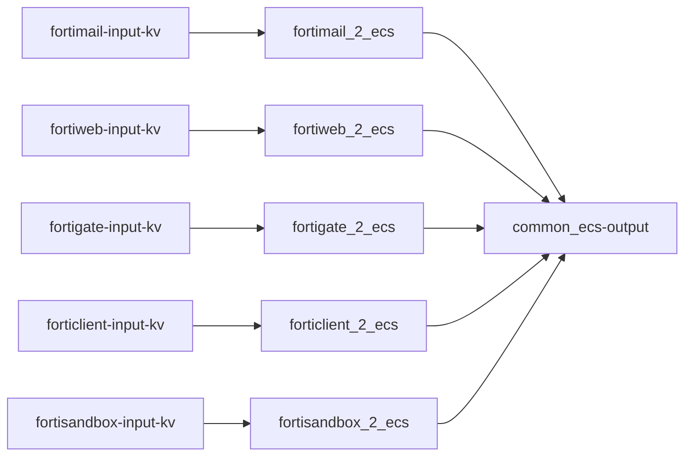

# Logstash


!!! warning "DEPRECATED"
    ❌ Do not deploy Logstash
    
    ✅ **Deploy Vector instead**
    
## Installation
1. [Install Logstash](https://www.elastic.co/guide/en/logstash/current/installing-logstash.html)

2. A good idea would be to setup your ES password as a [secret](https://www.elastic.co/guide/en/logstash/current/keystore.html#add-keys-to-keystore)

3. Set Logstash hostname  
!!! info "OPTIONAL"
    ℹ️ Optional config. Very useful if you run several logstash instances
Add HOSTNAME="myhostname" to /etc/default/logstash when running logstash as a service
```bash
echo HOSTNAME=\""$HOSTNAME"\" | sudo tee  -a /etc/default/logstash
```
4. Install tld filter plugin (You should do it every time you upgrade logstash version as well)
```bash
cd /usr/share/logstash
sudo bin/logstash-plugin install logstash-filter-tld
```
5. Copy [pipelines.yml](https://github.com/enotspe/fortinet-2-elasticsearch/blob/master/logstash/pipelines.yml) to your logstash folder.
6. Copy [conf.d](https://github.com/enotspe/fortinet-2-elasticsearch/tree/master/logstash/conf.d) content to your conf.d folder.
7. [Start logstash](https://www.elastic.co/guide/en/logstash/current/running-logstash.html)


## Pipelines sequence

Although we do not use logstash pipelines anymore, the logic is very similar on ingest pipelines.

The overall pipeline flow is as follows:




### Input Syslog / KV

Receives syslog logs and populates `data_stream` fields depending on udp port.
You can also uncomment Fortianalyzer tags is you are using it for syslog forwarding. Fortianalyzer stamps its own date format to the log, so it needs to be treated different.

Splits the original log into key-value pairs and sets the timestamp. Timezone is also obtained from the log itself if FortiOS v6.2+.

### Fortigate 2 ECS

* Validates nulls on IP fields. Fortinet loves to fill with "N/A" null fields, which turns into ingestion errors if your field has IP mapping. We could do it with grok.
* Renames Fortigate fields that overlaps with ECS. In the future this will be done on the kv filter stage, to be more ECS compliant.
* Translates Fortigate field to ECS by `type` of logs.
* Introduces `network.protocol_category` used on dashboards controls. Mega useful!!!
* Populates other ECS fields based on ECS recommendations, like `event.kind`, `event.category`, `event.type`.


### Common ECS / Output

Populates several ECS fields based on other present fields.

- `*.locality` for private, loopback, link-local, multicast and public addresses. **These fields are not ECS official fields**.
- Geo localitzation of IPs. 🌎
- `related.ip` and `related.user`.
- `network.bytes` and `network.packets`.
- `event.duration`. ⌛
- `event.hour_of_day` and `event.day_of_week`. **These fields are not ECS official fields**.
- Calcualtes `network.community_id` just for tcp/udp.
- Registered domain.
- Url parsing.
- `user_agent.*`.
- `network.transport`.

Output is based on index strategy, which is crucial for large ingestion cases 🤯. On Fortigate datastreams are split by `type`.

In our experience, `type=traffic` generates lots of logs, while `type=event` very few. Even inside `type=traffic` you might have that most of your logs have `action=denied`, so you may want to split them even further. Splitting into several datastreams allows to assign different ILMs policies and also will be faster for searching.

Elasticseach has a "statical" approach to datastream definition because we have to somehow map our strategy to the datastream fields. If we would like to add a couple of fields to our splitting decision, like `action` and `source.locality`, we would need to insert those fields into `data_stream.dataset` and we might impact index template and ILM. Surely if we want to benefit from a faster searching on those fields we would need to change their mapping to `constant_keyword`. We don't know in advance how our data is distributed, and even if we knew, that might change on the future.
