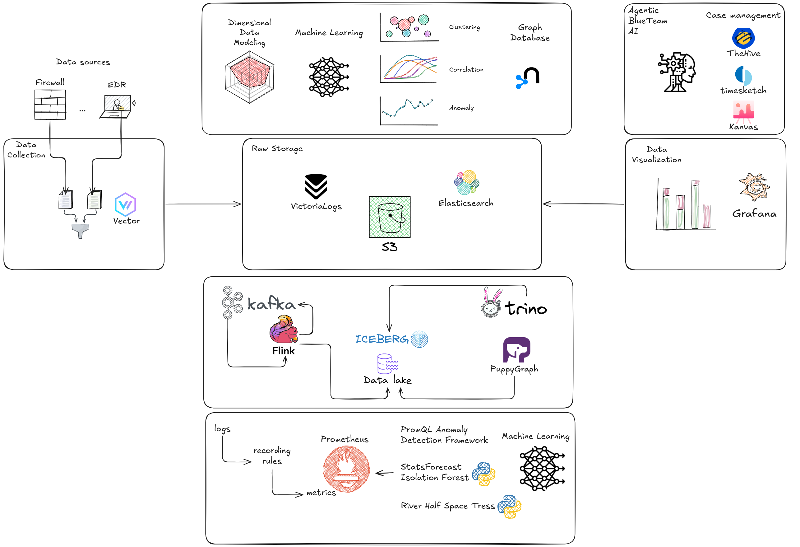
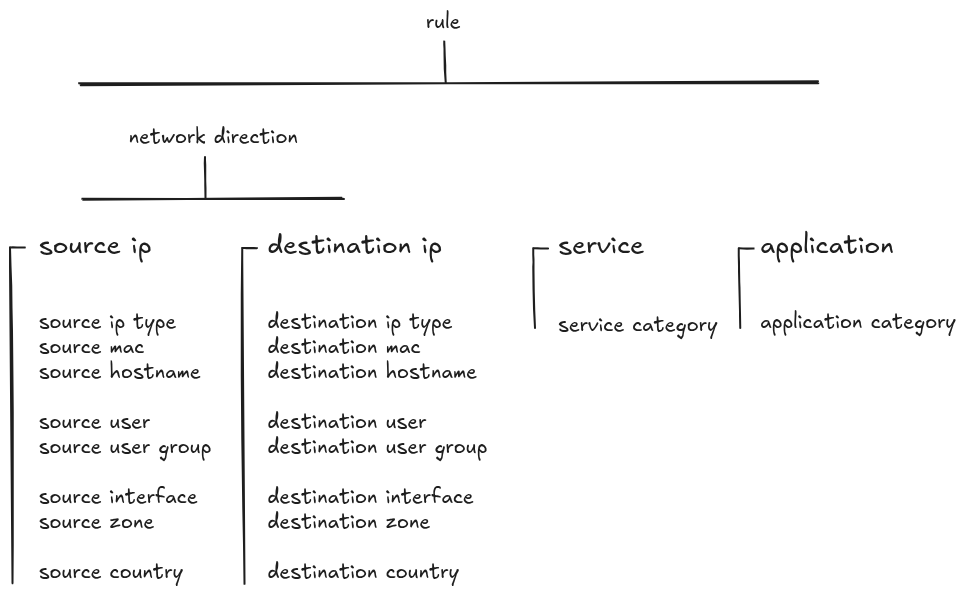

# Roadmap

Our resources are limited, but our vision is not! 🚀



## Where We Are Now

So far, we've built the foundation: raw logs that are **parsed, normalized, and enriched** with great visualizations for analysis. You can hunt threats manually with powerful dashboards that surface patterns across millions of logs.

**But we're just getting started.**

The next logical step? Alerts, right? 

**Wrong.**

## Alert Fatigue

Let's be real: throwing countless detection rules to generate countless alerts is just not serious. Our day-to-day as blue teamers is dealing with false positives 99% of the time. We don't want more of that sh*t!!!

Every SIEM vendor promises "correlation". Then you deploy it, and within a week, you're drowning in alerts. You tune the rules. Adjust the thresholds. Whitelist the exceptions. And within a month, you've created a Frankenstein monster of overlapping rules with so many exceptions that noone really remembers why they were there in the first place, and still generate thousands of alerts.

**Correlation has become a hell instead of the promised wonderland we were told.**

## A Different Approach: Making sense out of firewall logs

We need to think fundamentally different. 

The problem isn't that we lack rules — we have too many.

The problem isn't that we lack detections — we're drowning in it.

The problem is that **traditional rule-based detection doesn't apply** to the complexity and volume of modern network traffic. A rule like "if X happens, then alert" really does not make any sense for network logs because **each individual log is almost worthless**.

As we discussed previously on [The Challenge](index.md#the-challenge), we need to see the whole forest, not an specific tree. We need systems that understand context, learn baselines, and surface truly anomalous behavior.


## Dimensional Data Modeling


### **The new ~~5~~4-tupple**

Firewall [datasets](https://github.com/enotspe/fortinet-2-elasticsearch/tree/main/datasets/Fortinet/Fortigate/7.6/unique_fields) contain over 200 fields. We can't pivot on them all.

We need to choose **core anchors** that become the foundation for our analysis. These are our **dimensionas**:



- **Source IPs** 
- **Destination IPs** 
- **Services** (Protocol/Destination Port)
- **Applications** 

Every query, every visualization, every anomaly detection model — they all orbit around these core entities.

There are also some other dimensions we might want to pivot our analysis from, but they can mostly be derived from the anchors ones, like:

- Users
- Source/Destination Zones - Internal, DMZ, Internet, Partner networks
- Device Types - Workstation, server, mobile, IoT
- Geographic Context - Country, region for external IPs


### **Model Your Infrastructure, Not Hard-Code Exceptions**

Not all the information comes in our firewall logs.

When we create an exception on a rule, what we're really doing is encoding knowledge about our infrastructure into the system—but in the worst possible way.

Instead of creating an exception for `10.0.5.42` on rule X because "`10.0.5.42` is our Active Directory server and it's OK that it has high volume of DNS traffic", we should tell the system **who** is who:

- Which hosts are Domain Controllers
- Which are web servers
- Which networks are for guests
- Which assets are critical

We need to fed with **context** our **dimensions**, then **ALL rules** automatically understand this context. No more whack-a-mole exception management. No more rules that break when you change infrastructure.

### **Facts: Aggregated Security Metrics**

Attackers can not hide the network. Even encrypted traffic still leaves a trace.

**What is really *behaivor* in the first place?** It is when you put 2 together 2 or more events (logs) to somewho find some insight that would not be possible to spot by just observing each event independetly.

Sounds cool! But how can we levereage this concept on the context of network traffic? 

**We must turn logs into metrics.**

A single log entry tells you almost nothing. But when you aggregate **facts across dimensions and time**, patterns emerge:

- `10.0.5.42` connected to 847 unique internal IPs in the last hour
- `10.0.5.42` has never talked to more than 12 IPs in an hour before
- 98% of those connections lasted less than 2 seconds

Now that's a behavior. And that behavior screams "IP scanning"

Defining these metrics is the real challenge. What are the features we want to synthethize? 

Let's take for example a very simple metric: 

- Connections per source IP over time windows

If we keep track of this metric for a particular source IP, we might never see any anomaly. But if we slice it up a little bit like:

- Connections per source IP over time windows for SMB traffic

We might see that this traffic spike out on a particular date.

We did not see it when using the first metric because most of the traffic for this particular Source IP was HTTP. SMB was just a small portion of the overall traffic, but still very important to spot that an exfiltration connection started.

Actually, both metrics are important to track. What we mean, is that the metrics we define will have to be coherent with the baselines we know we can contrast against. We know how SMB works and behaves, makes sense to synthethize a metric for it, but TCP/28943 has absolutly no meaning, therefore it makes no sense to slice that traffic. 

### **The Grain**

The grain is the unit of measurement. It is the unit of aggregation. It's the answer to "what does one row in my fact table represent?"

Let's aggregate with different time windows:

**1-Minute Window Grain:**
```
Grain: "One source IP's behavior in a 1-minute window"

| time_window         | source_ip    | unique_dests | total_connections | avg_duration | failed_pct |
|---------------------|--------------|--------------|-------------------|--------------|------------|
| 2024-11-17 14:23:00 | 10.0.5.42   | 5            | 5                 | 0.22s        | 0%         |
| 2024-11-17 14:24:00 | 10.0.5.42   | 5            | 5                 | 0.21s        | 0%         |
| 2024-11-17 14:25:00 | 10.0.5.42   | 5            | 5                 | 0.23s        | 0%         |
```

**Interpretation:** Looks normal. 5 destinations per minute could be:
- DNS queries to multiple resolvers
- Load-balanced service connections
- Legitimate application behavior

**1-Hour Window Grain:**
```
Grain: "One source IP's behavior in a 1-hour window"

| time_window         | source_ip    | unique_dests | total_connections | avg_duration | failed_pct |
|---------------------|--------------|--------------|-------------------|--------------|------------|
| 2024-11-17 14:00:00 | 10.0.5.42   | 300          | 312               | 0.18s        | 35%        |
```

**NOW we see the problem:**
- **300 unique destinations in an hour** - Way above baseline
- **35% failure rate** - Scanning for active hosts
- **0.18s average duration** - Quick probes, not real communication
- **Only 12 repeated connections** out of 312 total (300 unique)

**Same raw data. Same source IP. Same 1-minute snapshot showing 5 IPs. Completely different story.**

If `10.0.5.42` was legitimately communicating:

**1-Hour Window:**
```
| time_window         | source_ip    | unique_dests | total_connections | avg_duration | failed_pct |
|---------------------|--------------|--------------|-------------------|--------------|------------|
| 2024-11-17 14:00:00 | 10.0.5.42   | 5            | 3,600             | 45s          | 0.2%       |
```

**This tells a different story:**
- **5 unique destinations** (same as 1-minute window) - Constant set of servers
- **3,600 connections** - Sustained traffic over the hour (1 per second)
- **45s average duration** - Real sessions with data exchange
- **0.2% failure rate** - Normal network noise


Grain isn't just about time. It's also about entity scope:

**Per IP:**
- Grain: "One source IP's behavior"
- Catches: Compromised individual hosts

**Per Network:**
- Grain: "One /24 network's behavior"
- Catches: Entire subnet scanning (worm propagation)

**Per Source-Destination Pair:**
- Grain: "Communication between specific source and destination"
- Catches: Anomalous behavior in established relationships

Luckly we dont have to choose, we can aggregate at multiple grains.


### **Finding Anomalies**

"Free the Kraken"

It is time to birng the Machine Learning power to the game to help us find annomalies at its broadest meaning. 

1. **Anomaly Detection** - Statistical and ML-based approaches
2. **Baseline Comparison** - Individual baseline (is this host acting weird?) + Peer baseline (is this host different from similar hosts?)
3. **Peer Group Baselines** - Compare dimensions against their peers (all workstations, all servers, all users)
4. **Anomaly Clustering** - Are multiple anomalies related?

This isn't a rule. It doesn't require you to update thresholds every time your network changes.

### **Anomalous ≠ Malicious**

OK, now we have confidence that `10.0.5.42` is behaving weirdly. But anomalous doesn't always equals malicious.

**What do we do next?** We pivot to relationships.

If `10.0.5.42` connected to `10.0.5.43`, and `10.0.5.43` is **also** doing weird things, and `10.0.5.43` then connected to `10.0.5.44`, and `10.0.5.44` is **also** anomalous... now we have a **pattern**.

**This is lateral movement. This is propagation. This is a real threat.**

False positives don't stand over time. False positives don't cascade across dimensions. False positives are usually isolated.

The final piece of the puzzle is understanding the **relationships** between dimensions.

**From anomalous to malicious:** It's not about a single indicator. It's about the story that emerges when you connect the dots.


That's the vision. That's where we're going. 🐉


## Technical Roadmap

We must enter the rabbit hole of data science: **dimensional data modeling, feature extraction, aggregations, streaming analytics, behavioral baselines, anomaly detection** all in real-time.

### Phase 1: Data Lake Foundation

**Status:** Planning

We're currently ingesting directly from Vector to storage. This works great for analysis, but limits our ability to do complex real-time processing.

**Next:**

- **Kafka** - Stream processing backbone for real-time log ingestion
- **Flink** - Stream processing engine for real-time aggregations and enrichment
- **Apache Iceberg** - Open table format on S3 for massive-scale analytics
- **PuppyGraph** - Graph database for relationship mapping (who talked to whom, when, how often)
- **Trino** - SQL query engine for ad-hoc investigation across the data lake. Entry point to Grafana.

This foundation enables us to:
- Process logs in real-time
- Query across petabytes of historical data without breaking the bank
- Build entity relationships at scale

### Phase 2: Machine Learning Pipeline

**Status:** Research

Raw data lakes are worthless without intelligence on top.

**Building:**

- **Clustering** - Automatically group similar behaviors to detect new threat patterns
- **Feature Extraction** - Multi-dimensional risk calculation based on behavioral baselines
- **Correlation** - Automatic event correlation using graph traversal and temporal analysis
- **Anomaly Detection** - Statistical and ML-based approaches to surface unusual activity
- **Graph Analysis** - Nodes and edges for undestanding entity relationships at scale

The goal: **No more manual threshold tuning.** The system learns what's normal for your environment and adapts.

### Plan B: Metrics-First with Prometheus

That all would not be a piece of cake, what it we can find a shortcut?

The leaner, more opinionated approach:

- Recording Rules - Transform raw logs into time-series metrics in Prometheus
- PromQL - Query language specifically designed for time-series analytics
- Prometheus Anomaly Detection Framework - Apply ML directly to metrics
    - StatsForecast
    - Isolation Forest
    - River Half-Space Trees

This path gives us:

- Native integration with our existing Grafana stack
- Lower infrastructure complexity
- Purpose-built for time-series anomaly detection
- Faster iteration cycles

Or maybe we can even take a sharper shortcut and Greptime will be the answer to all our [prayers](https://docs.greptime.com/user-guide/flow-computation/overview/). 

### Phase 3: Agentic AI for Blue Team

**Status:** Dreaming (but seriously researching)

This is where it gets wild.

Imagine an AI agent that:
- **Investigates** suspicious patterns autonomously
- **Explains** its reasoning in natural language
- **Suggests** response actions based on similar past incidents
- **Learns** from your feedback (true positive vs. false positive)

Not replacing analysts—**augmenting** them. The AI handles the tedious investigation work, and presents you with: *"Here's what happened, here's why it's suspicious, here's what similar incidents looked like, and here's what we should do about it."*

Integration with:
- [TheHive](https://strangebee.com/thehive/) - Case management for incident tracking
- [Timesketch](https://timesketch.org/) - Timeline analysis for forensic investigation
- [Kanvas](https://findevil.io/Kanvas-page) - DF/IR case management tool that works with SOD (Spreadsheet of Doom)

## Continuous Evolution

We have not forget our day to day, we want to continuous improve what we have already built:

- **More data sources** - Palo Alto Cortex, Vicarius, Windows Sysmon
- **More dashboards** - Maybe a summary dashboard for your CISO who likes to do threat hunting in power point.
- **More storages** - Test GreptimeDB
- **More simplicity** - Curated Helm Charts / Terraforms for deploying for production.

## Why This Matters

The traditional approach to security tooling is:

1. Vendor sells you a black box
2. You feed it data
3. It generates alerts based on their rules
4. You drown in false positives
5. You blame the tool
6. Vendor sells you another black box that "uses AI"
7. Rinse and Repeat

**We're building the alternative:**

- Open source and transparent
- Built by practitioners who feel your pain
- Designed for firewall logs specifically, but expandable to other security sources
- Focused on reducing false positives, not maximizing alert counts
- Using modern data engineering and ML techniques, not marketing buzzwords


## Realistic Timeline?

Honestly? We don't know. 

**Current status:** ✅ Parsing and visualization (done and awesome)  
**Next milestone:** 🚧 Log to metrics (in progress)  
**Dream goal:** 🌟 Agentic AI blue teamer (on the horizon)

**Progress:** Slow but steady. Rome wasn't built in a day, and neither is the future of firewall log analytics. 🐉

We're a [solo](engage.md#support-the-project) team working on this in our spare time because we're tired of the current state of security tooling. Some of these features might take months. Some might take years. Some might prove to be dead ends.

But we're committed to the journey. Every commit gets us closer. Every contributor accelerates the timeline. Every user who deploys FortiDragon validates that this problem is worth solving.

**Want to make it go faster?** [Contribute](engage.md), [sponsor](engage.md#support-the-project), or just spread the word. 🚀
