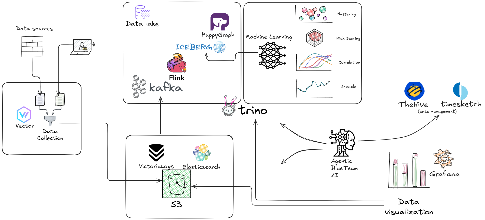

# Roadmap

Our resources are limited, but our vision is not! 🚀

## Where We Are Now

So far, we've built the foundation: raw logs that are **parsed, normalized, and enriched** with great visualizations for analysis. You can hunt threats manually with powerful dashboards that surface patterns across millions of logs.

**But we're just getting started.**

## Alert Fatigue

The next logical step? Alerts, right? 

**Wrong.**

Let's be real: throwing countless detection rules to generate countless alerts is just not serious. Our day-to-day as blue teamers is dealing with false positives 99% of the time. We don't want more of that sh*t!!!

Every SIEM vendor promises "correlation". Then you deploy it, and within a week, you're drowning in alerts. You tune the rules. Adjust the thresholds. Whitelist the exceptions. And within a month, you've created a Frankenstein monster of overlapping rules with so many exceptions that noone really remembers why they were there in the first place.

**Correlation has become a hell instead of the promised wonderland we were told.**

## A Different Approach

We need to think fundamentally different. 

The problem isn't that we lack rules — we have too many.

The problem isn't that we lack data — we're drowning in it.

The problem is that **traditional rule-based detection doesn't scale** to the complexity and volume of modern network traffic.

## Vision: Making sense out of firewall logs

Instead of writing rules that say "if X happens, alert," we need systems that:

### 1. **Model Your Infrastructure, Not Hard-Code Exceptions**

When we create an exception on a rule, what we're really doing is encoding knowledge about our infrastructure into the system—but in the worst possible way.

Instead of creating an exception for `10.0.5.42` on rule X because "`10.0.5.42` is our Active Directory server and it's OK that it has high volume of DNS traffic", we should tell the system **who** is who:

- Which hosts are Domain Controllers
- Which are web servers
- Which networks are for guests
- Which assets are critical

Imagine plugging your [CMDB](https://www.atlassian.com/itsm/it-asset-management/cmdb) directly into your log analytics. 

Then **ALL rules** automatically understand this context. No more whack-a-mole exception management. No more rules that break when you change infrastructure.

### 2. **Entities**

Firewall [datasets](https://github.com/enotspe/fortinet-2-elasticsearch/tree/main/datasets/Fortinet/Fortigate/7.6/unique_fields) contain over 200 fields. We can't pivot on them all.

We need to choose **core anchors** that become the foundation for all analysis. These are our **entities**:

- **Source IPs** - Who initiated the connection?
- **Destination IPs** - Who are they talking to?
- **Users / Devices** - Who's behind the keyboard?
- **Services** - What protocols and services?
- **Applications** - What L7 application?

Every query, every visualization, every anomaly detection model — they all orbit around these core entities.

### 3. **Aggregated Security Metrics**

As we discussed in [The Challenge](index.md#the-challenge), the real power comes when we see the full picture. Individual logs are worthless. Aggregated patterns are key.

We must define **metrics that matter**:

- Connections per source IP over time windows
- Unique destinations per source
- Data transfer volume by application
- Failed authentication attempts by user
- Geographic diversity of connections

These aren't just dashboards—they're the **features** for anomaly detection. They're what we compare against baselines. They're how we spot the slow port scanner, the beaconing malware, the credential stuffing attack.

### 4. **Correlate Across Multiple Data Sources**

Correlation within a single data source is easy. The real challenge? Real-time correlation across **multiple streams**.

Maybe your firewall shows nothing suspicious for `10.0.5.42`— just normal HTTPS traffic. But at that exact moment, your EDR is screaming about suspicious process execution on that same host.

**Separately:** Nothing concerning  
**Together:** Active compromise in progress

This requires:
- Unified entity resolution (same host across different log sources)
- Temporal alignment (events happening within the same time window)
- Stream processing (can't wait to batch process when threats move in seconds)

### 5. **Finding Anomalies**

**Correlation** at its broadest meaning

1. **Clustering** - Group similar behaviors automatically
2. **Peer Group Baselines** - Compare entities against their peers (all workstations, all servers, all users)
3. **Baseline Comparison** - Individual baseline (is this host acting weird?) + Peer baseline (is this host different from similar hosts?)
4. **Anomaly Detection** - Statistical and ML-based approaches
5. **Anomaly Clustering** - Are multiple anomalies related?

This isn't a rule. It's a pipeline. It adapts. It learns. It doesn't require you to update thresholds every time your network changes.

### 6. **Anomalous ≠ Malicious**

OK, now we have confidence that `10.0.5.42` is behaving weirdly. But anomalous doesn't always equals malicious.

**What do we do next?** We pivot to relationships.

If `10.0.5.42` connected to `10.0.5.43`, and `10.0.5.43` is **also** doing weird things, and `10.0.5.43` then connected to `10.0.5.44`, and `10.0.5.44` is **also** anomalous... now we have a **pattern**.

**This is lateral movement. This is propagation. This is a real threat.**

False positives don't stand over time. False positives don't cascade across entities. False positives are usually isolated.

The final piece of the puzzle is understanding the **relationships** between entities.

**From anomalous to malicious:** It's not about a single indicator. It's about the story that emerges when you connect the dots.

That's the vision. That's where we're going. 🐉

## Technical Roadmap

We must enter the rabbit hole of data science: **entities, feature extraction, aggregations, streaming analytics, behavioral baselines, anomaly detection** all in real-time.

### Phase 1: Data Lake Foundation

**Status:** Planning

We're currently ingesting directly from Vector to storage. This works great for analysis, but limits our ability to do complex real-time processing.

**Next:**
- **Kafka** - Stream processing backbone for real-time log ingestion
- **Flink** - Stream processing engine for real-time aggregations and enrichment
- **Apache Iceberg** - Open table format on S3 for massive-scale analytics
- **PuppyGraph** - Graph database for relationship mapping (who talked to whom, when, how often)
- **Trino** - SQL query engine for ad-hoc investigation across the data lake. Entry point to Grafana.

This foundation enables us to:
- Process logs in real-time
- Query across petabytes of historical data without breaking the bank
- Build entity relationships at scale

### Phase 2: Machine Learning Pipeline

**Status:** Research

Raw data lakes are worthless without intelligence on top.

**Building:**
- **Clustering** - Automatically group similar behaviors to detect new threat patterns
- **Feature Extraction** - Multi-dimensional risk calculation based on behavioral baselines
- **Correlation** - Automatic event correlation using graph traversal and temporal analysis
- **Anomaly Detection** - Statistical and ML-based approaches to surface unusual activity
- **Relational Analysis** - 

The goal: **No more manual threshold tuning.** The system learns what's normal for your environment and adapts.

### Phase 3: Agentic AI for Blue Team

**Status:** Dreaming (but seriously researching)

This is where it gets wild.

Imagine an AI agent that:
- **Investigates** suspicious patterns autonomously
- **Explains** its reasoning in natural language
- **Suggests** response actions based on similar past incidents
- **Learns** from your feedback (true positive vs. false positive)

Not replacing analysts—**augmenting** them. The AI handles the tedious investigation work, and presents you with: *"Here's what happened, here's why it's suspicious, here's what similar incidents looked like, and here's what we should do about it."*

Integration with:
- **TheHive** - Case management for incident tracking
- **Timesketch** - Timeline analysis for forensic investigation

## Continuous Evolution

We have not forget our day to day, we want to continuous improve what we have already built:

- **More data sources** - Palo Alto Cortex, Vicarius, Windows Sysmon
- **More dashboards**
- **More storages** - Test GreptimeDB
- **More simplicity** - Curated Helm Charts / Terraforms for deploying for production.

## Why This Matters

The traditional approach to security tooling is:
1. Vendor sells you a black box
2. You feed it data
3. It generates alerts based on their rules
4. You drown in false positives
5. You blame the tool
6. Vendor sells you another black box that "uses AI"
7. Repeat

**We're building the alternative:**
- Open source and transparent
- Built by practitioners who feel your pain
- Designed for firewall logs specifically, not as a generic afterthought
- Focused on reducing false positives, not maximizing alert counts
- Using modern data engineering and ML techniques, not marketing buzzwords

## Realistic Timeline?

Honestly? We don't know. 

**Current status:** ✅ Parsing and visualization (done and awesome)  
**Next milestone:** 🚧 Log to metrics (in progress)  
**Dream goal:** 🌟 Agentic AI blue teamer (on the horizon)

**Progress:** Slow but steady. Rome wasn't built in a day, and neither is the future of firewall log analytics. 🐉

We're a solo team working on this in our spare time because we're tired of the current state of security tooling. Some of these features might take months. Some might take years. Some might prove to be dead ends.

But we're committed to the journey. Every commit gets us closer. Every contributor accelerates the timeline. Every user who deploys FortiDragon validates that this problem is worth solving.

**Want to make it go faster?** [Contribute](engage.md), [sponsor](engage.md#support-the-project), or just spread the word. 🚀
